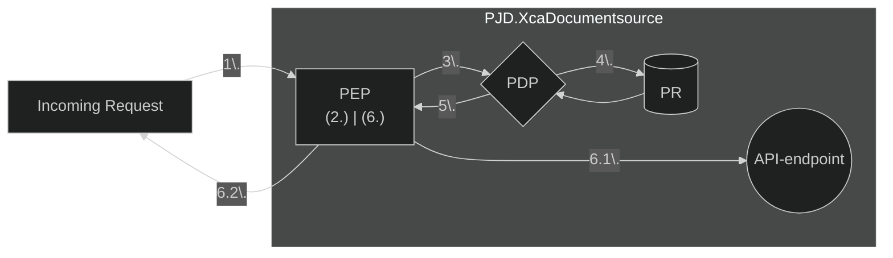
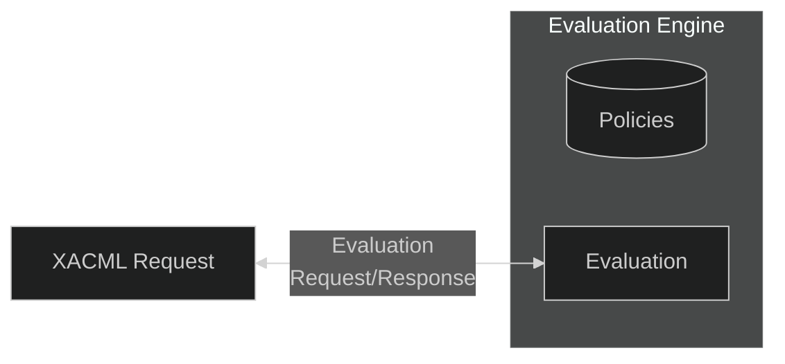
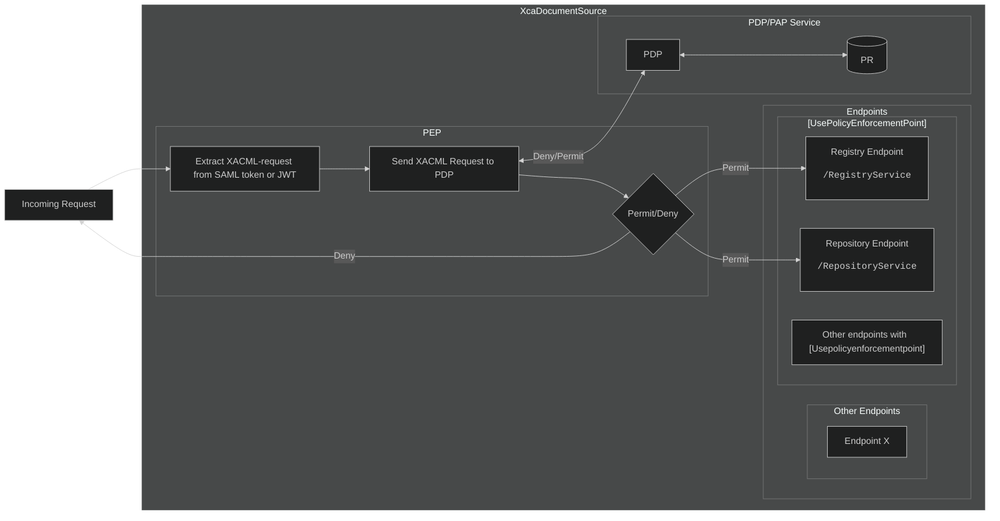

# Authorization and Access Control
To effectively control who gets access to resources, **PJD.XcaDocumentSource** implements the P*P pattern for access control and authorization (PEP, PDP, PR), leveraging standards like **XACML Version 2.0** - part of the broader **Identity and Access Management (IAM)** domain.  

See [Xacml 2.0 Core Spec (PDF) - docs.oasis-open.org ↗](https://docs.oasis-open.org/xacml/2.0/access_control-xacml-2.0-core-spec-os.pdf) for more info.

## Authorization flow



### Explanation
&emsp;1.&nbsp;*A request is sent to one of **PJD.XcaDocumentSource's** endpoints which uses **Policy Enforcement Point (PEP)*** 

&emsp;2.&nbsp;*The **PEP** Extracts a Xacml V2.0 request from the requests authorization details (ie. SAML-token in a SOAP-envelope or JWT in HTTP headers)*

&emsp;3.&nbsp;*The **PEP** sends the request to the **Policy Decision Point (PDP)***

&emsp;4.&nbsp;*The **PDP** queries - or has cached - The **Policy Repository (PR)***

&emsp;5.&nbsp;*The **PDP** has evaluated the request against the policies in the Repository and sends the decision result back to the Policy Enforcement Point*

&emsp;6.&nbsp;*The **PEP** receives the decision response.*

&emsp;6.1.&nbsp;*The **PEP** sends the request on to the API-endpoint*  

&emsp;6.2.&nbsp;*The **PEP** denies the request*

## Requests and Policies
In the user authorization domain, there are three parts; the Requests, the Policies and the Evaluation Engine.
The Evaluation Engine contains the Policies, and is able to validate an incoming Request based on this.



## Policy Enforcement Point
**The Policy Enforcement Point** (PEP) sits in front of an API-endpoint (such as the SOAP-endpoints) and intercepts (enforces a policy upon) the request by parsing the authentication details from the request and sending it to the Policy Decision Point (PDP), to authorize the request.

### The Policy Enforcement Point and API-Endpoints
The Policy Enforcement Point is registered as a **middleware-component** in the **ASP.NET Core Middleware Pipeline** and intercepts the requests before they enter the controllers endpoint.
An extension method is also used to define it in the applications `Program.cs`-file, similar to other components.
```c#
app.UsePolicyEnforcementPointMiddleware();
```
*Excerpt from **XcaXds.WebService**'s `Program.cs`-file*  

#### The `[UsePolicyEnforcementPoint]`-Attribute

A custom attribute is used on each API controller which needs access control.Classes decorated with `[UsePolicyEnforcementPoint]` will go through the Policy Enforcement Point middleware (`PolicyEnforcementPointMiddlware.cs`).




*Flow-diagram of Policy Enforcement Point*


## Policy Decision Point
**PJD.XcaDocumentSource** uses the `Abc.Xacml`-library to generate, serialize and evaluate policy requests.  
[Abc.Xacml - github.com ↗](https://github.com/abc-software/abc.xacml)


## Policy Repository
The default implementation of the policy repository is of a simple file-system storage. Policies are found in `<Solution>\XcaXds.Source\PolicyRepository\` and each policy is stored as a separate JSON-file.  
Upon initalization of the `FileBasedPolicyRepository`, all the files in the `PolicyRepository`-folder is read and parsed as **PolicyDto** types, which are added to a **PolicySetDto** which is maintained through Dependency Injection as a **Singleton**-instance.

## XACML Request
A XACML request features attributes which state who and what kind of user is attempting to perform a certain action. This request is evaluated by the Evaluation Engine, which contains the policies defining the access rights to the content of the system.


### Converting SAML-attributes to XACML-attributes
The XACML-Request is generated by the **Policy Enforcement Point (PEP)** from fields in the **SAML-token**. Every eligible attribute is transformed from **HL7 XML Schema Instance (XSI)** snippet or similar codeable datatype, into a custom `CodedValue` type, which is then added as up to three attributes in the XACML-request, appending `:code`, `:codeSystem` or `:displayName` to the end of a give attribute.


```xml
<saml:Attribute Name="urn:oasis:names:tc:xspa:1.0:subject:purposeOfUse">
  <saml:AttributeValue>
    <PurposeOfUse xmlns="urn:hl7-org:v3" xsi:type="CE" code="TREAT" codeSystem="urn:oid:2.16.840.1.113883.1.11.20448" codeSystemName="PurposeOfUse (HL7)" displayName="Treatment"/>
  </saml:AttributeValue>
</saml:Attribute>
```
***HL7 XSI Snippet** from the `PurposeOfUse` SAML-attribute*

Here, `code` and `codeSystem` from the HL7 snippet are each transformed by the **PEP** into separate attributes

```xml
<xacml-context:Attribute AttributeId="urn:oasis:names:tc:xspa:1.0:subject:purposeOfUse:code" 
    DataType="http://www.w3.org/2001/XMLSchema#string">
  <xacml-context:AttributeValue>TREAT</xacml-context:AttributeValue>
</xacml-context:Attribute>
<xacml-context:Attribute AttributeId="urn:oasis:names:tc:xspa:1.0:subject:purposeOfUse:codeSystem" 
    DataType="http://www.w3.org/2001/XMLSchema#string">
  <xacml-context:AttributeValue>urn:oid:2.16.840.1.113883.1.11.20448</xacml-context:AttributeValue>
</xacml-context:Attribute>
```
*The **HL7 XSI Snippet** when parsed by the **PEP**; with `:code` and `:codeSystem` separated out into two distinct attributes*

<details>
<summary><big><strong> 🔎 View example XML XACML-Request</strong></big></summary>

```xml
<xacml-context:Request xmlns:xacml-context="urn:oasis:names:tc:xacml:2.0:context:schema:os">
  <xacml-context:Subject SubjectCategory="urn:oasis:names:tc:xacml:1.0:subject-category:access-subject">
    <xacml-context:Attribute AttributeId="urn:oasis:names:tc:xspa:1.0:subject:subject-id" 
        DataType="http://www.w3.org/2001/XMLSchema#string">
      <xacml-context:AttributeValue>KVART GREVLING</xacml-context:AttributeValue>
    </xacml-context:Attribute>
    <xacml-context:Attribute AttributeId="urn:oasis:names:tc:xspa:1.0:subject:role:code" 
        DataType="http://www.w3.org/2001/XMLSchema#string">
      <xacml-context:AttributeValue>LE</xacml-context:AttributeValue>
    </xacml-context:Attribute>
    <xacml-context:Attribute AttributeId="urn:oasis:names:tc:xspa:1.0:subject:role:codeSystem" 
        DataType="http://www.w3.org/2001/XMLSchema#string">
      <xacml-context:AttributeValue>urn:oid:2.16.578.1.12.4.1.1.9060</xacml-context:AttributeValue>
    </xacml-context:Attribute>
    <xacml-context:Attribute AttributeId="urn:oasis:names:tc:xspa:1.0:subject:role:displayName" 
        DataType="http://www.w3.org/2001/XMLSchema#string">
      <xacml-context:AttributeValue>Lege</xacml-context:AttributeValue>
    </xacml-context:Attribute>
    <xacml-context:Attribute AttributeId="urn:oasis:names:tc:xspa:2.0:subject:npi" 
        DataType="http://www.w3.org/2001/XMLSchema#string">
      <xacml-context:AttributeValue>565505933</xacml-context:AttributeValue>
    </xacml-context:Attribute>
    <xacml-context:Attribute AttributeId="urn:oasis:names:tc:xspa:1.0:subject:purposeOfUse:code" 
        DataType="http://www.w3.org/2001/XMLSchema#string">
      <xacml-context:AttributeValue>TREAT</xacml-context:AttributeValue>
    </xacml-context:Attribute>
    <xacml-context:Attribute AttributeId="urn:oasis:names:tc:xspa:1.0:subject:purposeOfUse:codeSystem" 
        DataType="http://www.w3.org/2001/XMLSchema#string">
      <xacml-context:AttributeValue>urn:oid:2.16.840.1.113883.1.11.20448</xacml-context:AttributeValue>
    </xacml-context:Attribute>
    <xacml-context:Attribute AttributeId="urn:oasis:names:tc:xspa:1.0:subject:purposeOfUse:displayName" 
        DataType="http://www.w3.org/2001/XMLSchema#string">
      <xacml-context:AttributeValue>Treatment</xacml-context:AttributeValue>
    </xacml-context:Attribute>
    <xacml-context:Attribute AttributeId="urn:no:ehelse:saml:1.0:subject:SecurityLevel" 
        DataType="http://www.w3.org/2001/XMLSchema#string">
      <xacml-context:AttributeValue>4</xacml-context:AttributeValue>
    </xacml-context:Attribute>
    <xacml-context:Attribute AttributeId="urn:oasis:names:tc:xacml:1.0:subject:subject-id" 
        DataType="http://www.w3.org/2001/XMLSchema#string">
      <xacml-context:AttributeValue>KVART GREVLING</xacml-context:AttributeValue>
    </xacml-context:Attribute>
    <xacml-context:Attribute AttributeId="urn:oasis:names:tc:xspa:1.0:subject:organization" 
        DataType="http://www.w3.org/2001/XMLSchema#string">
      <xacml-context:AttributeValue>VOSS HERAD</xacml-context:AttributeValue>
    </xacml-context:Attribute>
    <xacml-context:Attribute AttributeId="urn:oasis:names:tc:xspa:1.0:subject:organization-id:code" 
        DataType="http://www.w3.org/2001/XMLSchema#string">
      <xacml-context:AttributeValue>960510542</xacml-context:AttributeValue>
    </xacml-context:Attribute>
    <xacml-context:Attribute AttributeId="urn:oasis:names:tc:xspa:1.0:subject:organization-id:codeSystem" 
        DataType="http://www.w3.org/2001/XMLSchema#string">
      <xacml-context:AttributeValue>urn:oid:2.16.578.1.12.4.1.4.101</xacml-context:AttributeValue>
    </xacml-context:Attribute>
    <xacml-context:Attribute AttributeId="urn:oasis:names:tc:xspa:1.0:subject:child-organization:code" 
        DataType="http://www.w3.org/2001/XMLSchema#string">
      <xacml-context:AttributeValue>874593842</xacml-context:AttributeValue>
    </xacml-context:Attribute>
    <xacml-context:Attribute AttributeId="urn:oasis:names:tc:xspa:1.0:subject:child-organization:codeSystem" 
        DataType="http://www.w3.org/2001/XMLSchema#string">
      <xacml-context:AttributeValue>urn:oid:2.16.578.1.12.4.1.4.101</xacml-context:AttributeValue>
    </xacml-context:Attribute>
    <xacml-context:Attribute AttributeId="urn:oasis:names:tc:xacml:2.0:subject:role:code" 
        DataType="http://www.w3.org/2001/XMLSchema#string">
      <xacml-context:AttributeValue>LE</xacml-context:AttributeValue>
    </xacml-context:Attribute>
    <xacml-context:Attribute AttributeId="urn:oasis:names:tc:xacml:2.0:subject:role:codeSystem" 
        DataType="http://www.w3.org/2001/XMLSchema#string">
      <xacml-context:AttributeValue>urn:oid:2.16.578.1.12.4.1.1.9060</xacml-context:AttributeValue>
    </xacml-context:Attribute>
    <xacml-context:Attribute AttributeId="urn:oasis:names:tc:xacml:2.0:subject:role:displayName" 
        DataType="http://www.w3.org/2001/XMLSchema#string">
      <xacml-context:AttributeValue>Lege</xacml-context:AttributeValue>
    </xacml-context:Attribute>
    <xacml-context:Attribute AttributeId="urn:oasis:names:tc:xspa:1.0:subject:npi" 
        DataType="http://www.w3.org/2001/XMLSchema#string">
      <xacml-context:AttributeValue>565505933</xacml-context:AttributeValue>
    </xacml-context:Attribute>
  </xacml-context:Subject>
  <xacml-context:Resource>
    <xacml-context:Attribute AttributeId="urn:oasis:names:tc:xacml:2.0:resource:resource-id:code" 
        DataType="http://www.w3.org/2001/XMLSchema#string">
      <xacml-context:AttributeValue>29698496140</xacml-context:AttributeValue>
    </xacml-context:Attribute>
    <xacml-context:Attribute AttributeId="urn:oasis:names:tc:xacml:2.0:resource:resource-id:codeSystem" 
        DataType="http://www.w3.org/2001/XMLSchema#string">
      <xacml-context:AttributeValue>2.16.578.1.12.4.1.4.1</xacml-context:AttributeValue>
    </xacml-context:Attribute>
    <xacml-context:Attribute AttributeId="urn:oasis:names:tc:xacml:1.0:resource:resource-id:code" 
        DataType="http://www.w3.org/2001/XMLSchema#string">
      <xacml-context:AttributeValue>29698496140</xacml-context:AttributeValue>
    </xacml-context:Attribute>
    <xacml-context:Attribute AttributeId="urn:oasis:names:tc:xacml:1.0:resource:resource-id:codeSystem" 
        DataType="http://www.w3.org/2001/XMLSchema#string">
      <xacml-context:AttributeValue>2.16.578.1.12.4.1.4.1</xacml-context:AttributeValue>
    </xacml-context:Attribute>
  </xacml-context:Resource>
  <xacml-context:Action>
    <xacml-context:Attribute AttributeId="urn:oasis:names:tc:xacml:1.0:action:action-id" 
        DataType="http://www.w3.org/2001/XMLSchema#string">
      <xacml-context:AttributeValue>ReadDocumentList</xacml-context:AttributeValue>
    </xacml-context:Attribute>
  </xacml-context:Action>
  <xacml-context:Environment />
</xacml-context:Request>
```
*Full XACML request with fields parsed from SAML-token*

</details>

<br>

> ⁉️ **But why not insert the XSI/Coded XML as a raw XML string instead?**  
The coded attributes are split into distinct XACML Request attributes (e.g., `:code`, `:codeSystem`) for readability and compliance with the XACML specification. Policy engines can behave unpredictably when fed raw XML strings, so this separation avoids validation issues.  
It also enables fine-grained control: policies can allow or deny specific codes and code systems independently. This makes policy design more intuitive, since each attribute concerns a single value, and it supports OR-semantics naturally.  
Finally, because the same code may exist across multiple code systems, explicitly separating them prevents ambiguity. Bundling codes and code systems into a single XML string gets **messy**...quick!


## DTOs for policy and Policy Set
**PJD.XcaDocumentSource** features a DTO for Policies and Policy Sets. This allows for easier creation and storage of policies. XACML-classes and concepts are abstracted behind a simpler JSON structure.  
By default, the `PolicySetDto` generated from the policies in the Policy Repository defaults to the `deny-overrides` (`urn:oasis:names:tc:xacml:1.0:policy-combining-algorithm:deny-overrides`)-combining algorithm.  
If any child (Policy/Rule) evaluates to Deny, the result is Deny, regardless whether other policies or rules Permit.

### Data Model for PolicySetDTO/PolicyDTO
|Field|Type/Optionality|card|XACML-equivalent|Comments|
|--|--|--|--|--|
|**`PolicySetDto`**|PolicySetDto (R)|[1..1]|`<PolicySet>`|The top-level **Policy Set DTO**|
|&emsp;L&nbsp;**`SetId`**|string(R)|[1..1]|`@PolicySetId`|The **Unique ID** of the **Policy Set**|
|&emsp;L&nbsp;**`CombiningAlgorithm`**|string(R)|[1..1]|`@CombiningAlgorithm`|Algorithm used to combine the result of multiple policies|
|&emsp;L&nbsp;**`Policies`**|List&lt;PolicyDto&gt;(R)|[1..1]|`/PolicySet/Policies[]`|The List of Policies for this PolicySet|
|&emsp;&emsp;L&nbsp;**`PolicyDto`**|PolicyDto(R)|[1..*]|`<Policy>`|A **Policy DTO**|
|&emsp;&emsp;&emsp;L&nbsp;**`appliesTo`**|Enum(Issuer)(R)|[1..1]|`N/A`|The User type which the policy applies to|
|&emsp;&emsp;&emsp;L&nbsp;**`id`**|string(R)|[1..1]|`@PolicyId`|The **Unique ID** of the **Policy**|
|&emsp;&emsp;&emsp;L&nbsp;**`Rules`**|List&lt;PolicyMatch&gt;(O)|[1..*]|`<Rule><Condition>`|A container for statements that the request must match|
|&emsp;&emsp;&emsp;&emsp;L&nbsp;**`AttributeId`**|string(R)|[1..1]|`<AttributeDesignator>`|The attribute ID to check for similar values|
|&emsp;&emsp;&emsp;&emsp;L&nbsp;**`Value`**|string(R)|[1..1]|`<AttributeValue>`|The value to compare with the request|
|&emsp;&emsp;&emsp;L&nbsp;**`Subjects`**|PolicyMatch(O)|[1..*]|`<Subject>`|The subjects that this policy will apply to|
|&emsp;&emsp;&emsp;&emsp;L&nbsp;**`AttributeId`**|string(R)|[1..1]|`<AttributeDesignator>`|The subject attributes to match|
|&emsp;&emsp;&emsp;&emsp;L&nbsp;**`Value`**|string(R)|[1..1]|`<AttributeValue>`|The subject value to compare with the request|
|&emsp;&emsp;&emsp;L&nbsp;**`Roles`**|PolicyMatch(O)|[1..1]|`<Roles>`|The roles that must be present in the request|
|&emsp;&emsp;&emsp;&emsp;L&nbsp;**`AttributeId`**|string(R)|[1..1]|`<AttributeDesignator>`|The role attributes to match|
|&emsp;&emsp;&emsp;&emsp;L&nbsp;**`Value`**|string(R)|[1..1]|`<AttributeValue>`|The role values that must be present in the request|
|&emsp;&emsp;&emsp;L&nbsp;**`Resources`**|PolicyMatch(O)|[1..1]|`<Resources>`|The specific resources that this policy constrains|
|&emsp;&emsp;&emsp;&emsp;L&nbsp;**`AttributeId`**|string(R)|[1..1]|`<AttributeDesignator>`|The resource attributes to match|
|&emsp;&emsp;&emsp;&emsp;L&nbsp;**`Value`**|string(R)|[1..1]|`<AttributeValue>`|The resource values that must be present in the request|


### AND/OR Semantics
**XACML 2.0** features functions that can perform certain operations on attributes or collections of attributes.
In DTO-semantics, this has been simplified for easier configuration and setup.

For the **DTO**s, every item in the `Rules` property are treated with **AND**-semantics.  
Multi-value fields are also supported; any `value` property separated by semicolon are treated with **OR**-semantics.

#### Example: JSON DTO-policy snippet with AND/OR semantics 
Below is a snippet showing how multiple values and attributed can be combined.
```json
//....
"rules":[
  [
    // If this attribute has...
    {
      "attributeId": "urn:oasis:names:tc:xspa:1.0:subject:role:code",
      // ... a value of either "LE" OR "SP"...
      "value": "LE;SP" 
    },
    //...AND this attribute has this value...
    {
        "attributeId": "urn:oasis:names:tc:xspa:1.0:subject:role:codeSystem",
        "value": "urn:oid:2.16.578.1.12.4.1.1.9060"
    }
  ],
  [
    // OR this rule set
    {
        "attributeId": "urn:oasis:names:tc:xspa:1.0:subject:othervalue",
        "value": "anotherpotentialvalue"
    }
  ]
]
// Permit the request
"effect": "Permit"
//...
```
*Policy DTO with AND/OR semantics*

This how the XACML XML will be mapped from the DTO. 
```xml
<xacml:Rule RuleId="urn:rule:fd5473b8530640faa53b0449d3c05a80" Effect="Permit">
    <xacml:Condition>
        <xacml:Apply FunctionId="urn:oasis:names:tc:xacml:1.0:function:and">
            <xacml:Apply FunctionId="urn:oasis:names:tc:xacml:1.0:function:or">
                <xacml:Apply FunctionId="urn:oasis:names:tc:xacml:1.0:function:string-equal">
                    <xacml:AttributeValue DataType="http://www.w3.org/2001/XMLSchema#string">LE</xacml:AttributeValue>
                    <xacml:Apply FunctionId="urn:oasis:names:tc:xacml:1.0:function:string-one-and-only">
                        <xacml:SubjectAttributeDesignator 
                          AttributeId="urn:oasis:names:tc:xspa:1.0:subject:role:code" 
                          DataType="http://www.w3.org/2001/XMLSchema#string"/>
                    </xacml:Apply>
                </xacml:Apply>
                <xacml:Apply FunctionId="urn:oasis:names:tc:xacml:1.0:function:string-equal">
                    <xacml:AttributeValue DataType="http://www.w3.org/2001/XMLSchema#string">SP</xacml:AttributeValue>
                    <xacml:Apply FunctionId="urn:oasis:names:tc:xacml:1.0:function:string-one-and-only">
                        <xacml:SubjectAttributeDesignator 
                          AttributeId="urn:oasis:names:tc:xspa:1.0:subject:role:code" 
                          DataType="http://www.w3.org/2001/XMLSchema#string"/>
                    </xacml:Apply>
                </xacml:Apply>
            </xacml:Apply>
            <xacml:Apply FunctionId="urn:oasis:names:tc:xacml:1.0:function:or">
                <xacml:Apply FunctionId="urn:oasis:names:tc:xacml:1.0:function:string-equal">
                    <xacml:AttributeValue DataType="http://www.w3.org/2001/XMLSchema#string">urn:oid:2.16.578.1.12.4.1.1.9060</xacml:AttributeValue>
                    <xacml:Apply FunctionId="urn:oasis:names:tc:xacml:1.0:function:string-one-and-only">
                        <xacml:SubjectAttributeDesignator 
                          AttributeId="urn:oasis:names:tc:xspa:1.0:subject:role:codeSystem" 
                          DataType="http://www.w3.org/2001/XMLSchema#string"/>
                    </xacml:Apply>
                </xacml:Apply>
            </xacml:Apply>
        </xacml:Apply>
    </xacml:Condition>
</xacml:Rule>
```
*The XACML-rule created from the Policy DTO above*

### Action-mapping
The XACML 2.0 specification does not enforce specific values for the `<Action>`-segment of a `<Policy>` or `<Request>`.  
For SOAP-requests, **PJD.XcaDocumentSource** maps from the `<Action>` in the `<Header>` to specific values for the appropriate action.

|XACML-action|SOAP-action
|--|--|
|`ReadDocumentList`|`urn:ihe:iti:2007:RegistryStoredQuery`<br>`urn:ihe:iti:2007:CrossGatewayQuery`|
|`ReadDocuments`|`urn:ihe:iti:2007:RetrieveDocumentSet`<br>`urn:ihe:iti:2007:CrossGatewayRetrieve`|
|`Create`|`urn:ihe:iti:2007:ProvideAndRegisterDocumentSet-b`<br>`urn:ihe:iti:2007:RegisterDocumentSet-b`|
|`Delete`|`urn:ihe:iti:2010:DeleteDocumentSet`<br>`urn:ihe:iti:2017:RemoveDocuments`|

### Example #1 - Allow certain types of healthcare personell
```json
{
  "appliesTo": "HelseId",
  "id": "90bd12ea-1a26-417f-a035-f3708f4e0198",
  "rules": [
    [
      {
        "attributeId": "urn:no:ehelse:saml:1.0:subject:SecurityLevel",
        "value": "4"
      },
      {
        "attributeId": "urn:oasis:names:tc:xspa:1.0:subject:role:code",
        "value": "LE;SP"
      },
      {
        "attributeId": "urn:oasis:names:tc:xspa:1.0:subject:role:codeSystem",
        "value": "urn:oid:2.16.578.1.12.4.1.1.9060;2.16.578.1.12.4.1.1.9060"
      },
      {
        "attributeId": "urn:oasis:names:tc:xspa:1.0:subject:purposeOfUse:code",
        "value": "TREAT;ETREAT;COC;BTG"
      },
      {
        "attributeId": "urn:oasis:names:tc:xspa:1.0:subject:purposeOfUse:codeSystem",
        "value": "urn:oid:2.16.840.1.113883.1.11.20448;2.16.840.1.113883.1.11.20448"
      }
    ]
  ],
  "actions": [
    "ReadDocumentList"
  ],
  "effect": "Permit"
}
```
*Example of a policy where LE and SP (healthcare personell with role **Lege** and **Sykepleier**) are allowed to read a document list (**ReadDocumentList**). Due to the nature of the `deny-overrides` combining algorithm, only values defined in the policy are permitted*

## Endpoints for managing Access control
API-endpoints for performing CRUD-operations on policies are available. These serve as easy-to-use interfaces for configuring access control for **PJD.XcaDocumentSource**

### Get All Policies as Policy Set
| Property  | Description |
|---|---|
| HTTP action | GET |
| Short description | Upload a Document reference and/or associated document to the registry or repository |
| Endpoint URL | /api/policy/upload |
| Request Query | `xml`(O) - Boolean value<br>Return **XACML XML**-formatted or **DTO JSON**-formatted response | 
| Response Object | `PolicySetDto` (`application/json`)<br>`<PolicySet>` (`application/xml`) |

#### Example 
##### Request
```
GET <baseurl>/api/policy/getall?xml=true
```
<details>
<summary><big><strong> 🔎 View example JSON Response</strong></big></summary>

```json
{
  "setId": "62427a73-0c33-45dc-b269-70ea80d0fac5",
  "combiningAlgorithm": "urn:oasis:names:tc:xacml:1.0:policy-combining-algorithm:deny-overrides",
  "policies": [
    {
      "id": "90bd12ea-1a26-417f-a035-f3708f4e0198",
      "appliesTo": "HelseId",
      "rules": [
        [
          {
            "attributeId": "urn:no:ehelse:saml:1.0:subject:SecurityLevel",
            "value": "4"
          },
          {
            "attributeId": "urn:oasis:names:tc:xspa:1.0:subject:role:code",
            "value": "LE;SP"
          },
          {
            "attributeId": "urn:oasis:names:tc:xspa:1.0:subject:role:codeSystem",
            "value": "urn:oid:2.16.578.1.12.4.1.1.9060;2.16.578.1.12.4.1.1.9060"
          },
          {
            "attributeId": "urn:oasis:names:tc:xspa:1.0:subject:purposeOfUse:code",
            "value": "TREAT;ETREAT;COC;BTG"
          },
          {
            "attributeId": "urn:oasis:names:tc:xspa:1.0:subject:purposeOfUse:codeSystem",
            "value": "urn:oid:2.16.840.1.113883.1.11.20448;2.16.840.1.113883.1.11.20448"
          }
        ]
      ],
      "actions": [
        "ReadDocumentList"
      ],
      "effect": "Permit"
    },
    {
      "id": "deny-certain-roles",
      "appliesTo": "HelseId",
      "rules": [
        [
          {
            "attributeId": "urn:oasis:names:tc:xspa:1.0:subject:role:code",
            "value": "XX;VE;FB"
          },
          {
            "attributeId": "urn:oasis:names:tc:xspa:1.0:subject:role:codeSystem",
            "value": "urn:oid:2.16.578.1.12.4.1.1.9060;2.16.578.1.12.4.1.1.9060"
          }
        ]
      ],
      "effect": "Deny"
    }
  ]
}
```
*PolicySet DTO*

</details>

<details>
<summary><big><strong> 🔎 View example XML Response</strong></big></summary>

```xml
  <xacml:PolicySet PolicySetId="urn:uuid:62427a73-0c33-45dc-b269-70ea80d0fac5" PolicyCombiningAlgId="urn:oasis:names:tc:xacml:1.0:policy-combining-algorithm:deny-overrides" Version="1.0" xmlns:xacml="urn:oasis:names:tc:xacml:2.0:policy:schema:os">
    <xacml:Target />
    <xacml:Policy PolicyId="urn:uuid:90bd12ea-1a26-417f-a035-f3708f4e0198" RuleCombiningAlgId="urn:oasis:names:tc:xacml:1.0:policy-combining-algorithm:deny-overrides" Version="1.0">
      <xacml:CombinerParameters />
      <xacml:Target>
        <xacml:Actions>
          <xacml:Action>
            <xacml:ActionMatch MatchId="urn:oasis:names:tc:xacml:1.0:function:string-equal">
              <xacml:AttributeValue DataType="http://www.w3.org/2001/XMLSchema#string">ReadDocumentList</xacml:AttributeValue>
              <xacml:ActionAttributeDesignator AttributeId="urn:oasis:names:tc:xacml:1.0:action:action-id" DataType="http://www.w3.org/2001/XMLSchema#string" />
            </xacml:ActionMatch>
          </xacml:Action>
        </xacml:Actions>
      </xacml:Target>
      <xacml:Rule RuleId="urn:rule:8e0dc7910e6742128f0dd78f103860f8" Effect="Permit">
        <xacml:Condition>
          <xacml:Apply FunctionId="urn:oasis:names:tc:xacml:1.0:function:and">
            <xacml:Apply FunctionId="urn:oasis:names:tc:xacml:1.0:function:string-equal">
              <xacml:AttributeValue DataType="http://www.w3.org/2001/XMLSchema#string">4</xacml:AttributeValue>
              <xacml:Apply FunctionId="urn:oasis:names:tc:xacml:1.0:function:string-one-and-only">
                <xacml:SubjectAttributeDesignator AttributeId="urn:no:ehelse:saml:1.0:subject:SecurityLevel" DataType="http://www.w3.org/2001/XMLSchema#string" />
              </xacml:Apply>
            </xacml:Apply>
            <xacml:Apply FunctionId="urn:oasis:names:tc:xacml:1.0:function:or">
              <xacml:Apply FunctionId="urn:oasis:names:tc:xacml:1.0:function:string-equal">
                <xacml:AttributeValue DataType="http://www.w3.org/2001/XMLSchema#string">LE</xacml:AttributeValue>
                <xacml:Apply FunctionId="urn:oasis:names:tc:xacml:1.0:function:string-one-and-only">
                  <xacml:SubjectAttributeDesignator AttributeId="urn:oasis:names:tc:xspa:1.0:subject:role:code" DataType="http://www.w3.org/2001/XMLSchema#string" />
                </xacml:Apply>
              </xacml:Apply>
              <xacml:Apply FunctionId="urn:oasis:names:tc:xacml:1.0:function:string-equal">
                <xacml:AttributeValue DataType="http://www.w3.org/2001/XMLSchema#string">SP</xacml:AttributeValue>
                <xacml:Apply FunctionId="urn:oasis:names:tc:xacml:1.0:function:string-one-and-only">
                  <xacml:SubjectAttributeDesignator AttributeId="urn:oasis:names:tc:xspa:1.0:subject:role:code" DataType="http://www.w3.org/2001/XMLSchema#string" />
                </xacml:Apply>
              </xacml:Apply>
            </xacml:Apply>
            <xacml:Apply FunctionId="urn:oasis:names:tc:xacml:1.0:function:or">
              <xacml:Apply FunctionId="urn:oasis:names:tc:xacml:1.0:function:string-equal">
                <xacml:AttributeValue DataType="http://www.w3.org/2001/XMLSchema#string">urn:oid:2.16.578.1.12.4.1.1.9060</xacml:AttributeValue>
                <xacml:Apply FunctionId="urn:oasis:names:tc:xacml:1.0:function:string-one-and-only">
                  <xacml:SubjectAttributeDesignator AttributeId="urn:oasis:names:tc:xspa:1.0:subject:role:codeSystem" DataType="http://www.w3.org/2001/XMLSchema#string" />
                </xacml:Apply>
              </xacml:Apply>
              <xacml:Apply FunctionId="urn:oasis:names:tc:xacml:1.0:function:string-equal">
                <xacml:AttributeValue DataType="http://www.w3.org/2001/XMLSchema#string">2.16.578.1.12.4.1.1.9060</xacml:AttributeValue>
                <xacml:Apply FunctionId="urn:oasis:names:tc:xacml:1.0:function:string-one-and-only">
                  <xacml:SubjectAttributeDesignator AttributeId="urn:oasis:names:tc:xspa:1.0:subject:role:codeSystem" DataType="http://www.w3.org/2001/XMLSchema#string" />
                </xacml:Apply>
              </xacml:Apply>
            </xacml:Apply>
            <xacml:Apply FunctionId="urn:oasis:names:tc:xacml:1.0:function:or">
              <xacml:Apply FunctionId="urn:oasis:names:tc:xacml:1.0:function:string-equal">
                <xacml:AttributeValue DataType="http://www.w3.org/2001/XMLSchema#string">TREAT</xacml:AttributeValue>
                <xacml:Apply FunctionId="urn:oasis:names:tc:xacml:1.0:function:string-one-and-only">
                  <xacml:SubjectAttributeDesignator AttributeId="urn:oasis:names:tc:xspa:1.0:subject:purposeOfUse:code" DataType="http://www.w3.org/2001/XMLSchema#string" />
                </xacml:Apply>
              </xacml:Apply>
              <xacml:Apply FunctionId="urn:oasis:names:tc:xacml:1.0:function:string-equal">
                <xacml:AttributeValue DataType="http://www.w3.org/2001/XMLSchema#string">ETREAT</xacml:AttributeValue>
                <xacml:Apply FunctionId="urn:oasis:names:tc:xacml:1.0:function:string-one-and-only">
                  <xacml:SubjectAttributeDesignator AttributeId="urn:oasis:names:tc:xspa:1.0:subject:purposeOfUse:code" DataType="http://www.w3.org/2001/XMLSchema#string" />
                </xacml:Apply>
              </xacml:Apply>
              <xacml:Apply FunctionId="urn:oasis:names:tc:xacml:1.0:function:string-equal">
                <xacml:AttributeValue DataType="http://www.w3.org/2001/XMLSchema#string">COC</xacml:AttributeValue>
                <xacml:Apply FunctionId="urn:oasis:names:tc:xacml:1.0:function:string-one-and-only">
                  <xacml:SubjectAttributeDesignator AttributeId="urn:oasis:names:tc:xspa:1.0:subject:purposeOfUse:code" DataType="http://www.w3.org/2001/XMLSchema#string" />
                </xacml:Apply>
              </xacml:Apply>
              <xacml:Apply FunctionId="urn:oasis:names:tc:xacml:1.0:function:string-equal">
                <xacml:AttributeValue DataType="http://www.w3.org/2001/XMLSchema#string">BTG</xacml:AttributeValue>
                <xacml:Apply FunctionId="urn:oasis:names:tc:xacml:1.0:function:string-one-and-only">
                  <xacml:SubjectAttributeDesignator AttributeId="urn:oasis:names:tc:xspa:1.0:subject:purposeOfUse:code" DataType="http://www.w3.org/2001/XMLSchema#string" />
                </xacml:Apply>
              </xacml:Apply>
            </xacml:Apply>
            <xacml:Apply FunctionId="urn:oasis:names:tc:xacml:1.0:function:or">
              <xacml:Apply FunctionId="urn:oasis:names:tc:xacml:1.0:function:string-equal">
                <xacml:AttributeValue DataType="http://www.w3.org/2001/XMLSchema#string">urn:oid:2.16.840.1.113883.1.11.20448</xacml:AttributeValue>
                <xacml:Apply FunctionId="urn:oasis:names:tc:xacml:1.0:function:string-one-and-only">
                  <xacml:SubjectAttributeDesignator AttributeId="urn:oasis:names:tc:xspa:1.0:subject:purposeOfUse:codeSystem" DataType="http://www.w3.org/2001/XMLSchema#string" />
                </xacml:Apply>
              </xacml:Apply>
              <xacml:Apply FunctionId="urn:oasis:names:tc:xacml:1.0:function:string-equal">
                <xacml:AttributeValue DataType="http://www.w3.org/2001/XMLSchema#string">2.16.840.1.113883.1.11.20448</xacml:AttributeValue>
                <xacml:Apply FunctionId="urn:oasis:names:tc:xacml:1.0:function:string-one-and-only">
                  <xacml:SubjectAttributeDesignator AttributeId="urn:oasis:names:tc:xspa:1.0:subject:purposeOfUse:codeSystem" DataType="http://www.w3.org/2001/XMLSchema#string" />
                </xacml:Apply>
              </xacml:Apply>
            </xacml:Apply>
          </xacml:Apply>
        </xacml:Condition>
      </xacml:Rule>
    </xacml:Policy>
    <xacml:Policy PolicyId="urn:uuid:deny-certain-roles" RuleCombiningAlgId="urn:oasis:names:tc:xacml:1.0:policy-combining-algorithm:deny-overrides" Version="1.0">
      <xacml:CombinerParameters />
      <xacml:Target />
      <xacml:Rule RuleId="urn:rule:740cc207a25240a5a98632b86c302b69" Effect="Deny">
        <xacml:Condition>
          <xacml:Apply FunctionId="urn:oasis:names:tc:xacml:1.0:function:and">
            <xacml:Apply FunctionId="urn:oasis:names:tc:xacml:1.0:function:or">
              <xacml:Apply FunctionId="urn:oasis:names:tc:xacml:1.0:function:string-equal">
                <xacml:AttributeValue DataType="http://www.w3.org/2001/XMLSchema#string">XX</xacml:AttributeValue>
                <xacml:Apply FunctionId="urn:oasis:names:tc:xacml:1.0:function:string-one-and-only">
                  <xacml:SubjectAttributeDesignator AttributeId="urn:oasis:names:tc:xspa:1.0:subject:role:code" DataType="http://www.w3.org/2001/XMLSchema#string" />
                </xacml:Apply>
              </xacml:Apply>
              <xacml:Apply FunctionId="urn:oasis:names:tc:xacml:1.0:function:string-equal">
                <xacml:AttributeValue DataType="http://www.w3.org/2001/XMLSchema#string">VE</xacml:AttributeValue>
                <xacml:Apply FunctionId="urn:oasis:names:tc:xacml:1.0:function:string-one-and-only">
                  <xacml:SubjectAttributeDesignator AttributeId="urn:oasis:names:tc:xspa:1.0:subject:role:code" DataType="http://www.w3.org/2001/XMLSchema#string" />
                </xacml:Apply>
              </xacml:Apply>
              <xacml:Apply FunctionId="urn:oasis:names:tc:xacml:1.0:function:string-equal">
                <xacml:AttributeValue DataType="http://www.w3.org/2001/XMLSchema#string">FB</xacml:AttributeValue>
                <xacml:Apply FunctionId="urn:oasis:names:tc:xacml:1.0:function:string-one-and-only">
                  <xacml:SubjectAttributeDesignator AttributeId="urn:oasis:names:tc:xspa:1.0:subject:role:code" DataType="http://www.w3.org/2001/XMLSchema#string" />
                </xacml:Apply>
              </xacml:Apply>
            </xacml:Apply>
            <xacml:Apply FunctionId="urn:oasis:names:tc:xacml:1.0:function:or">
              <xacml:Apply FunctionId="urn:oasis:names:tc:xacml:1.0:function:string-equal">
                <xacml:AttributeValue DataType="http://www.w3.org/2001/XMLSchema#string">urn:oid:2.16.578.1.12.4.1.1.9060</xacml:AttributeValue>
                <xacml:Apply FunctionId="urn:oasis:names:tc:xacml:1.0:function:string-one-and-only">
                  <xacml:SubjectAttributeDesignator AttributeId="urn:oasis:names:tc:xspa:1.0:subject:role:codeSystem" DataType="http://www.w3.org/2001/XMLSchema#string" />
                </xacml:Apply>
              </xacml:Apply>
              <xacml:Apply FunctionId="urn:oasis:names:tc:xacml:1.0:function:string-equal">
                <xacml:AttributeValue DataType="http://www.w3.org/2001/XMLSchema#string">2.16.578.1.12.4.1.1.9060</xacml:AttributeValue>
                <xacml:Apply FunctionId="urn:oasis:names:tc:xacml:1.0:function:string-one-and-only">
                  <xacml:SubjectAttributeDesignator AttributeId="urn:oasis:names:tc:xspa:1.0:subject:role:codeSystem" DataType="http://www.w3.org/2001/XMLSchema#string" />
                </xacml:Apply>
              </xacml:Apply>
            </xacml:Apply>
          </xacml:Apply>
        </xacml:Condition>
      </xacml:Rule>
    </xacml:Policy>
  </xacml:PolicySet>
```
*The PolicySet DTO when transformed into a XML XACML PolicySet*

</details>


### Get Single Policy
Gets a single policy. Can return it either as **DTO JSON**-format or **XML XACML**-format.

#### Example 
##### Request
```
GET <baseurl>/api/policy/getsingle?id=deny-certain-roles&xml=true
```
<details>
<summary><big><strong> 🔎 View example JSON Response</strong></big></summary>

```json
{
  "id": "deny-certain-roles",
  "appliesTo": "HelseId",
  "rules": [
    [
      {
          "matchId": null,
          "attributeId": "urn:oasis:names:tc:xspa:1.0:subject:role:code",
          "dataType": null,
          "value": "XX;VE;FB"
      },
      {
          "matchId": null,
          "attributeId": "urn:oasis:names:tc:xspa:1.0:subject:role:codeSystem",
          "dataType": null,
          "value": "urn:oid:2.16.578.1.12.4.1.1.9060;2.16.578.1.12.4.1.1.9060"
      }
    ]
  ],
  "subjects": null,
  "roles": null,
  "organizations": null,
  "resources": null,
  "actions": null,
  "effect": "Deny"
}
```
*A single Policy DTO*

</details>

<details>
<summary><big><strong> 🔎 View example XML Response</strong></big></summary>

```xml
<xacml:Policy xmlns:xacml="urn:oasis:names:tc:xacml:2.0:policy:schema:os" PolicyId="urn:uuid:deny-certain-roles" RuleCombiningAlgId="urn:oasis:names:tc:xacml:1.0:policy-combining-algorithm:deny-overrides" Version="1.0">
    <xacml:CombinerParameters/>
    <xacml:Target/>
    <xacml:Rule RuleId="urn:rule:fd5473b8530640faa53b0449d3c05a80" Effect="Deny">
        <xacml:Condition>
            <xacml:Apply FunctionId="urn:oasis:names:tc:xacml:1.0:function:and">
                <xacml:Apply FunctionId="urn:oasis:names:tc:xacml:1.0:function:or">
                    <xacml:Apply FunctionId="urn:oasis:names:tc:xacml:1.0:function:string-equal">
                        <xacml:AttributeValue DataType="http://www.w3.org/2001/XMLSchema#string">XX</xacml:AttributeValue>
                        <xacml:Apply FunctionId="urn:oasis:names:tc:xacml:1.0:function:string-one-and-only">
                            <xacml:SubjectAttributeDesignator AttributeId="urn:oasis:names:tc:xspa:1.0:subject:role:code" DataType="http://www.w3.org/2001/XMLSchema#string"/>
                        </xacml:Apply>
                    </xacml:Apply>
                    <xacml:Apply FunctionId="urn:oasis:names:tc:xacml:1.0:function:string-equal">
                        <xacml:AttributeValue DataType="http://www.w3.org/2001/XMLSchema#string">VE</xacml:AttributeValue>
                        <xacml:Apply FunctionId="urn:oasis:names:tc:xacml:1.0:function:string-one-and-only">
                            <xacml:SubjectAttributeDesignator AttributeId="urn:oasis:names:tc:xspa:1.0:subject:role:code" DataType="http://www.w3.org/2001/XMLSchema#string"/>
                        </xacml:Apply>
                    </xacml:Apply>
                    <xacml:Apply FunctionId="urn:oasis:names:tc:xacml:1.0:function:string-equal">
                        <xacml:AttributeValue DataType="http://www.w3.org/2001/XMLSchema#string">FB</xacml:AttributeValue>
                        <xacml:Apply FunctionId="urn:oasis:names:tc:xacml:1.0:function:string-one-and-only">
                            <xacml:SubjectAttributeDesignator AttributeId="urn:oasis:names:tc:xspa:1.0:subject:role:code" DataType="http://www.w3.org/2001/XMLSchema#string"/>
                        </xacml:Apply>
                    </xacml:Apply>
                </xacml:Apply>
                <xacml:Apply FunctionId="urn:oasis:names:tc:xacml:1.0:function:or">
                    <xacml:Apply FunctionId="urn:oasis:names:tc:xacml:1.0:function:string-equal">
                        <xacml:AttributeValue DataType="http://www.w3.org/2001/XMLSchema#string">urn:oid:2.16.578.1.12.4.1.1.9060</xacml:AttributeValue>
                        <xacml:Apply FunctionId="urn:oasis:names:tc:xacml:1.0:function:string-one-and-only">
                            <xacml:SubjectAttributeDesignator AttributeId="urn:oasis:names:tc:xspa:1.0:subject:role:codeSystem" DataType="http://www.w3.org/2001/XMLSchema#string"/>
                        </xacml:Apply>
                    </xacml:Apply>
                    <xacml:Apply FunctionId="urn:oasis:names:tc:xacml:1.0:function:string-equal">
                        <xacml:AttributeValue DataType="http://www.w3.org/2001/XMLSchema#string">2.16.578.1.12.4.1.1.9060</xacml:AttributeValue>
                        <xacml:Apply FunctionId="urn:oasis:names:tc:xacml:1.0:function:string-one-and-only">
                            <xacml:SubjectAttributeDesignator AttributeId="urn:oasis:names:tc:xspa:1.0:subject:role:codeSystem" DataType="http://www.w3.org/2001/XMLSchema#string"/>
                        </xacml:Apply>
                    </xacml:Apply>
                </xacml:Apply>
            </xacml:Apply>
        </xacml:Condition>
    </xacml:Rule>
</xacml:Policy>
```
*The same Policy when transformed into an XML XACML Policy*

</details>