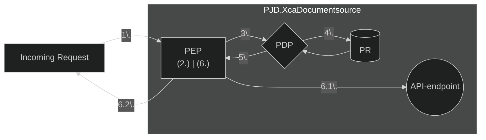
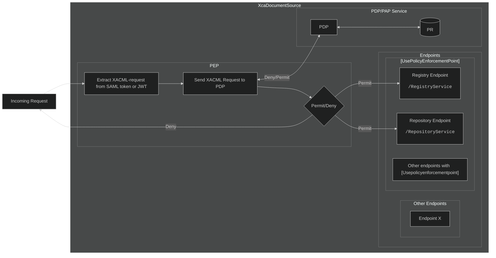

# Authorization and Access Control
To effectively control who gets access to resources, **PJD.XcaDocumentSource** implements the P*P pattern for access control and authorization (PEP, PDP, PR), leveraging standards like **XACML Version 2.0**.  
This pattern is also known as **Identity and access management (IAM)**.

See [Xacml 2.0 Core Spec (PDF) - docs.oasis-open.org ↗](https://docs.oasis-open.org/xacml/2.0/access_control-xacml-2.0-core-spec-os.pdf) for more info.

## Authorization flow



### Explanation
&emsp;1.&nbsp;*A request is sent to one of **PJD.XcaDocumentSource's** endpoints which uses **Policy Enforcement Point (PEP)*** 

&emsp;2.&nbsp;*The **PEP** Extracts a Xacml V2.0 request from the requests authorization details (ie. SAML-token in a SOAP-envelope or JWT in HTTP headers)*

&emsp;3.&nbsp;*The **PEP** sends the request to the **Policy Decision Point (PDP)***

&emsp;4.&nbsp;*The **PDP** queries - or has cached - The **Policy Repository (PR)***

&emsp;5.&nbsp;*The **PDP** has evaluated the request against the policies in the Repository and sends the decision result back to the Policy Enforcement Point*

&emsp;6.&nbsp;*The **PEP** receives the decision response.*

&emsp;6.1.&nbsp;*The **PEP** sends the request on to the API-endpoint*  

&emsp;6.2.&nbsp;*The **PEP** denies the request*

## Policy Enforcement Point
**The Policy Enforcement Point** (PEP) sits in front of an API-endpoint (such as the SOAP-endpoints) and intercepts the request, parses the authentication details from the request and sends it to the Policy Decision Point (PDP), to authorize the request.

### The Policy Enforcement Point and API-Endpoints
The Policy Enforcement Point is registered as a **middleware-component** in the **ASP.NET Core Middleware Pipeline** and intercepts the requests before they enter the controllers endpoint.
An extension method is also used to define it in the applications `Program.cs`-file, similar to other components.
```c#
app.UsePolicyEnforcementPointMiddleware();
```
*Excerpt from **XcaXds.WebService**'s `Program.cs`-file*  

#### The `[UsePolicyEnforcementPoint]`-Attribute

A custom attribute is used on each API controller which needs access control.Classes decorated with `[UsePolicyEnforcementPoint]` will go through the Policy Enforcement Point middleware (`PolicyEnforcementPointMiddlware.cs`).



*Flow-diagram of Policy Enforcement Point*

## Policy Decision Point
**PJD.XcaDocumentSource** uses the `Abc.Xacml`-library to generate, serialize and evaluate policy requests.  
[Abc.Xacml - github.com ↗](https://github.com/abc-software/abc.xacml)

## Policy Repository

## Endpoints for managing Access control
API-endpoints for performing CRUD-operations on policies are available. These serve as easy-to-use interfaces for configuring access control for **XcaDocumentSource**


## XACML-Terminology


### Policy - `<Rule>`
A `<Rule>` in a XACML-`<Policy>` defines conditions that the XACML-request must satisfy. A `<Rule>` features a `Effect` attribute with a value of either `Permit` or `Deny`. Policies can contain multiple rules, and based on the rule-combining algorithm, together make up whether the request is permitted or denied.

### Policy - `<Target>`
A `<Target>` in a XACML-`<Policy>` describes who the policy is intended for. XACML 2.0 requests and policies have 


## DTOs for policy and Policy Set
**XcaDocumentSource** features a DTO for policies. This allows for easier creation and storage of policies. Complex XACML-classes and concepts are abstracted behind simpler JSON structure.

### Example - NHN trust-framework compliant policy
```json
{
  "id": "90bd12ea-1a26-417f-a035-f3708f4e0198",
  "Rules": [
    {
      "attributeId": "urn:no:ehelse:saml:1.0:subject:SecurityLevel",
      "value": "4"
    },
    {
      "attributeId": "urn:oasis:names:tc:xspa:1.0:subject:role:code",
      "value": "LE;SP"
    },
    {
      "attributeId": "urn:oasis:names:tc:xspa:1.0:subject:role:codeSystem",
      "value": "urn:oid:2.16.578.1.12.4.1.1.9060;2.16.578.1.12.4.1.1.9060"
    },
    {
      "attributeId": "urn:oasis:names:tc:xspa:1.0:subject:purposeOfUse:code",
      "value": "TREAT;ETREAT;COC;BTG"
    },
    {
      "attributeId": "urn:oasis:names:tc:xspa:1.0:subject:purposeOfUse:codeSystem",
      "value": "urn:oid:2.16.840.1.113883.1.11.20448;2.16.840.1.113883.1.11.20448"
    }
  ],
  "actions": [
    "ReadDocumentList"
  ],
  "effect": "Permit"
}```
    "id": "90bd12ea-1a26-417f-a035-f3708f4e0198",
    "subjects": [
        {
            "matchId": "urn:oasis:names:tc:xacml:1.0:function:string-equal",
            "attributeId": "urn:oasis:names:tc:xspa:1.0:subject:role:code",
            "dataType": "http://www.w3.org/2001/XMLSchema#string",
            "value": "LE"
        },
        {
            "matchId": "urn:oasis:names:tc:xacml:1.0:function:string-equal",
            "attributeId": "urn:oasis:names:tc:xspa:1.0:subject:role:codeSystem",
            "dataType": "http://www.w3.org/2001/XMLSchema#string",
            "value": "urn:oid:2.16.578.1.12.4.1.1.9060"
        }
    ],
    "actions": [
        "ReadDocumentList"
    ],
    "effect": "Permit"
}
```

