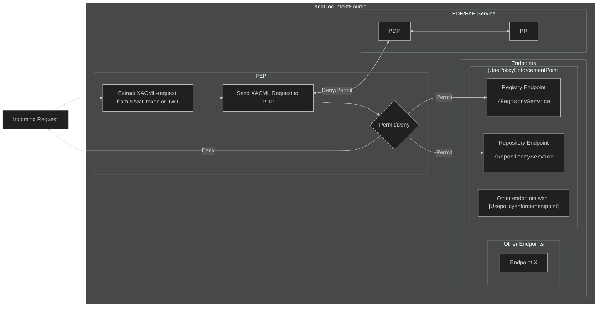

# Authorization and Access Control

## Policy Enforcement Point
### Using The Policy Enforcement Point With API-Controllers
The Policy Enforcement Point is registered as a **middleware-component** in the **ASP.NET Middleware Pipeline** and intercepts the requests before they enter the controllers endpoint.
An extension method is also used to define it in the applications `Program.cs`-file, similar to other components.
```c#
app.UsePolicyEnforcementPointMiddleware();
```
*Excerpt from XcaXds.WebService's `Program.cs`-file*  

#### The `[UsePolicyEnforcementPoint]`-Attribute

A custom attribute is used on each API controller which needs access control.Classes decorated with `[UsePolicyEnforcementPoint]` will go through the Policy Enforcement Point middleware (`PolicyEnforcementPointMiddlware.cs`).



*Flow-diagram of Policy Enforcement Point*

## Policy Decision Point

## Endpoints for managing Access control