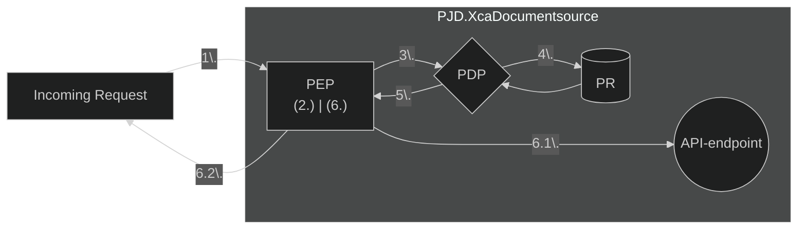
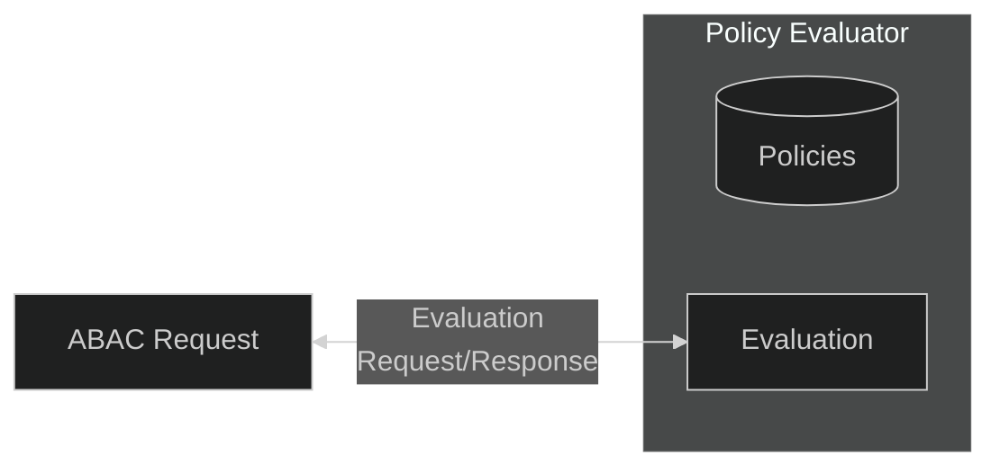
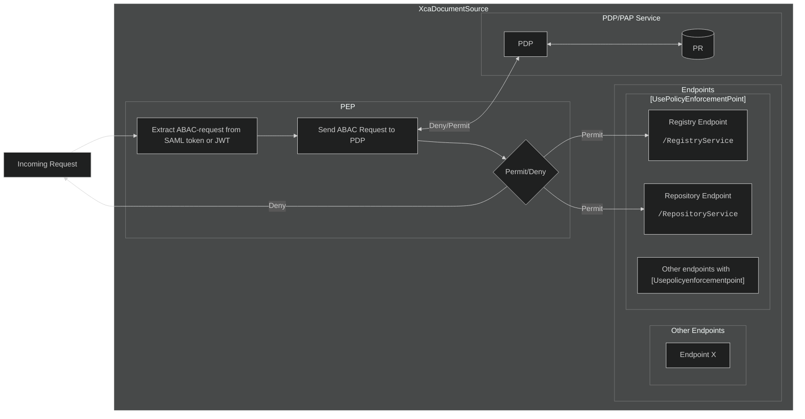

# Authorization and Access Control
To effectively control who gets access to resources, **PJD.XcaDocumentSource** implements the P*P pattern for access control and authorization (PEP, PDP, PR) using custom Attribute-Based Access Control (ABAC), inspired from XACML 2.0.
## Authorization flow


```mermaid
%%{init: {'theme':'dark'}}%%

flowchart LR


in[Incoming Request]

subgraph "PJD.XcaDocumentsource"
    pep["PEP<br>(2.) | (6.)"]
    pdp{PDP}
    pr[(&nbsp;&nbsp;PR&nbsp;&nbsp;)]
    ep((API-endpoint))
end

in  --1\.--> pep
pep --3\.--> pdp
pdp --4\.--> pr
pr  --> pdp
pdp --5\.--> pep
pep --6.1\.----> ep
pep --6.2\.--> in
```

### Explanation
&emsp;1.&nbsp;*A request is sent to one of **PJD.XcaDocumentSource's** endpoints which uses **Policy Enforcement Point (PEP)*** 

&emsp;2.&nbsp;*The **PEP** Extracts a ABAC-request from the requests authorization details (ie. SAML-token in a SOAP-envelope or JWT in HTTP headers)*

&emsp;3.&nbsp;*The **PEP** sends the request to the **Policy Decision Point (PDP)***

&emsp;4.&nbsp;*The **PDP** queries - or has cached - The **Policy Repository (PR)***

&emsp;5.&nbsp;*The **PDP** has evaluated the request against the policies in the Repository and sends the decision result back to the Policy Enforcement Point*

&emsp;6.&nbsp;*The **PEP** receives the decision response.*

&emsp;6.1.&nbsp;*The **PEP** sends the request on to the API-endpoint*  

&emsp;6.2.&nbsp;*The **PEP** denies the request*

## Requests and Policies
In the user authorization domain, there are three parts; the Requests, the Policies and the Policy Evaluator.
The Policy Evaluator contains the Policies, and is able to validate an incoming Request based on this.


```mermaid
%%{init: {'theme':'dark'}}%%
flowchart LR

subgraph "Policy Evaluator"
  direction TB
  pol[(&emsp;Policies&emsp;)]
  eval[Evaluation]
end

req[ABAC Request]
req<--Evaluation<br>Request/Response-->eval
```

## Policy Enforcement Point
**The Policy Enforcement Point** (PEP) sits in front of an API-endpoint (such as the SOAP-endpoints) and intercepts (enforces a policy upon) the request by parsing the authentication details from the request and sending it to the Policy Decision Point (PDP), to authorize the request.

### The Policy Enforcement Point and API-Endpoints
The Policy Enforcement Point is registered as a **middleware-component** in the **ASP.NET Core Middleware Pipeline** and intercepts the requests before they enter the controllers endpoint.
An extension method is also used to define it in the applications `Program.cs`-file, similar to other components.
```c#
app.UsePolicyEnforcementPointMiddleware();
```
*Excerpt from **XcaXds.WebService**'s `Program.cs`-file*  

#### The `[UsePolicyEnforcementPoint]`-Attribute

A custom attribute is used on each API controller which needs access control.Classes decorated with `[UsePolicyEnforcementPoint]` will go through the Policy Enforcement Point middleware (`PolicyEnforcementPointMiddlware.cs`).



```mermaid
%%{init: {'theme':'dark'}}%%

flowchart LR

incomingrequest[Incoming Request]

subgraph "XcaDocumentSource"
    subgraph "PEP"
        xtract[Extract ABAC-request from SAML token or JWT]
        sendpeprequest[Send ABAC Request to PDP]
        permitdeny{Permit/Deny}
    end
    subgraph "Endpoints"
        subgraph "Other Endpoints"
            epx[Endpoint X]
        end
        subgraph "[UsePolicyEnforcementPoint]"
            regep[Registry Endpoint<br><pre>/RegistryService]
            repep[Repository Endpoint<br><pre>/RepositoryService]
            othr["Other endpoints with  [Usepolicyenforcementpoint]"]
        end
    end
    subgraph "PDP/PAP Service"
        pdp[PDP] 
        pr[(&emsp;PR&emsp;)]
    end

end

incomingrequest--> xtract -->

sendpeprequest <--Deny/Permit--> pdp

pdp <--> pr

sendpeprequest-->permitdeny
permitdeny --Deny--> incomingrequest
permitdeny --Permit-->regep
permitdeny --Permit-->repep
```

*Flow-diagram of Policy Enforcement Point*


## Policy Decision PointXAC
### Business logic
**PJD.XcaDocumentSource** has specific business rules that go out of the scope of the **ABAC**-policy evaluation, and describes more domain-specific rules for access control.  

The more granular business logic is defined as [Expression Trees](https://learn.microsoft.com/en-us/dotnet/csharp/advanced-topics/expression-trees/) in `BusinessLogicFilters.cs`

#### Access Control Policy (ACP)
The ACP field (Attribute Name: `urn:ihe:iti:xua:2012:acp`) is a policy identifier, signaling which access control policy is relevant for this request.  
The values are a set of OIDs:
|OID|Description|
|---|---|
|nil/null - no value (SAML-token)<br>*or*<br>`2.16.578.1.12.4.1.7.2.1.0`(In ABAC-request)|**Healthcare professional** OR **citizen** (_subject_) is not obliged to any overrides for opening and seeing patient's healthcare data (_resource_) <br> e.g. Citizen (patient) represents themself|
|`2.16.578.1.12.4.1.7.2.1.1`|**Citizen** (_subject_) is has parent representation for child under the age of 12 (_resource_)|
|`2.16.578.1.12.4.1.7.2.1.2`|**Citizen** (_subject_) has retrieved consent to represent another citizen (_resource_)|
|`2.16.578.1.12.4.1.7.2.1.3`|**Citizen** (_subject_) represents on behalf of citizen unable to give consent (_resource_).|
|`2.16.578.1.12.4.1.7.2.1.4`|**Healthcare professional** (_subject_) is not obliged to retrieve patient's consent to  open and see patient's healthcare data (_resource_), e.g. "patient's regular physician" (fastlege)|
|`2.16.578.1.12.4.1.7.2.1.5`	|**Healthcare professional** (_subject_) has been given explicit consent from patient (_resource_) to open and see patient's healthcare data, including locked data|
|`2.16.578.1.12.4.1.7.2.1.6`	|**Healthcare professional** (_subject_) is not able to retrieve consent from current patient (_resource_) (e.g. patient is unconscious)|
|`2.16.578.1.12.4.1.7.2.1.7`	|**Healthcare professional** (_subject_) has documented reasons to unlock all available healthcare data for current patient (_resource_) in an emergency/catastrophic situation|
|`2.16.578.1.12.4.1.7.2.1.8`	|**Healthcare professional** (_subject_) has retrieved consent from patient (_resource_) to open and see patient's healthcare data|

##### Example
```xml
<Attribute FriendlyName="Patient Privacy Policy Identifier" 
  Name="urn:ihe:iti:xua:2012:acp" 
  NameFormat="urn:oasis:names:tc:SAML:2.0:attrname-format:uri">
  <AttributeValue xmlns:a=http://www.w3.org/2001/XMLSchema-instance 
    xmlns:tn="http://www.w3.org/2001/XMLSchema" 
    a:type="tn:anyURI">urn:oid:2.16.578.1.12.4.1.7.2.1.1</AttributeValue>
</Attribute>
```
#### Usage of ACP with other SAML-attributes
The **ACP** field is used in conjunction with the `urn:oasis:names:tc:xacml:2.0:resource:resource-id` and `urn:ihe:iti:xua:2017:subject:provider-identifier` SAML-attributes to 


## Policy Repository
The default implementation of the policy repository is of a simple file-system storage. Policies are found in `<Solution>\XcaXds.Source\PolicyRepository\` and each policy is stored as a separate JSON-file.  
Upon initalization of the `FileBasedPolicyRepository`, all the files in the `PolicyRepository`-folder is read and parsed as **PolicyDto** types, which are added to a **PolicySetDto** which is maintained through Dependency Injection as a **Singleton**-instance.

## ABAC Request
An ABAC request features attributes which state who and what kind of user is attempting to perform a certain action. This request is evaluated by the Policy Evaluator, which contains the policies defining the access rights to the content of the system.

### Custom attributes for ABAC requests


|Code|Description|
|--|--|
|`urn:no:nhn:xcads:document:patient-identifier` |The patient identifier defined in the document entry for the document being requested |
|`urn:no:nhn:xcads:adhocquery:patient-identifier` |The Patient identifier in the AdhocQuery request (`$XDSDocumentEntryPatientId`)|
|`urn:no:nhn:xcads:document:uniqueid` |The unqiue identifier for the document being requested (DocumentUniqueId)|
|`urn:no:nhn:xcads:document:repositoryuniqueid` |The OID for the Repository (RepositoryUniqueId) |
|`urn:no:nhn:xcads:document:homecommunityid` |The OID for the HomeCommunity (HomeCommunityId)|

### Converting SAML-attributes to ABAC-attributes
The ABAC-Request is a simple key-value structure, generated by the **Policy Enforcement Point (PEP)** from fields in the **SAML-token**. Every eligible attribute is transformed from **HL7 XML Schema Instance (XSI)** snippet or similar codeable datatype, into a custom `CodedValue` type, which is then added as up to three attributes in the ABAC-request, appending `:code`, `:codeSystem` or `:displayName` to the end of a given attribute.


```xml
<saml:Attribute Name="urn:oasis:names:tc:xspa:1.0:subject:purposeOfUse">
  <saml:AttributeValue>
    <PurposeOfUse xmlns="urn:hl7-org:v3" xsi:type="CE" code="TREAT" codeSystem="urn:oid:2.16.840.1.113883.1.11.20448" codeSystemName="PurposeOfUse (HL7)" displayName="Treatment"/>
  </saml:AttributeValue>
</saml:Attribute>
```
***HL7 XSI Snippet** from the `PurposeOfUse` SAML-attribute*

Here, `code` and `codeSystem` from the HL7 snippet are each transformed by the **PEP** into separate attributes

```json
//......
  ],
  "urn:oasis:names:tc:xspa:1.0:subject:purposeOfUse:code": [
      "TREAT"
  ],
  "urn:oasis:names:tc:xspa:1.0:subject:purposeOfUse:codeSystem": [
      "urn:oid:2.16.840.1.113883.1.11.20448"
  ],
//......
```
*The **HL7 XSI Snippet** when parsed by the **PEP**; with `:code` and `:codeSystem` separated out into two distinct attributes*

<details>
<summary><big><strong> 🔎 View example ABAC-Request</strong></big></summary>

```json
{
    "attributes": {
        "urn:no:nhn:xcads:adhocquery:patient-identifier:code": [
            "da538ce8-eb6c-4422-887a-6bbdb500e95a"
        ],
        "urn:no:nhn:xcads:adhocquery:patient-identifier:codeSystem": [
            "2.16.578.1.12.4.5.100.3.15"
        ],
        "urn:oasis:names:tc:xspa:1.0:subject:subject-id": [
            "GR\\u00D8NN VITS"
        ],
        "urn:oasis:names:tc:xspa:1.0:subject:role:code": [
            "LE"
        ],
        "urn:oasis:names:tc:xspa:1.0:subject:role:codeSystem": [
            "urn:oid:2.16.578.1.12.4.1.1.9060"
        ],
        "urn:oasis:names:tc:xspa:1.0:subject:role:displayName": [
            "Lege"
        ],
        "urn:oasis:names:tc:xspa:2.0:subject:npi": [
            "565501872"
        ],
        "urn:oasis:names:tc:xspa:1.0:subject:purposeOfUse:code": [
            "TREAT"
        ],
        "urn:oasis:names:tc:xspa:1.0:subject:purposeOfUse:codeSystem": [
            "urn:oid:2.16.840.1.113883.1.11.20448"
        ],
        "urn:oasis:names:tc:xspa:1.0:subject:purposeOfUse:displayName": [
            "Treatment"
        ],
        "urn:oasis:names:tc:xacml:2.0:resource:resource-id:code": [
            "17855599120"
        ],
        "urn:oasis:names:tc:xacml:2.0:resource:resource-id:codeSystem": [
            "2.16.578.1.12.4.1.4.1"
        ],
        "urn:no:ehelse:saml:1.0:subject:SecurityLevel": [
            "4"
        ],
        "urn:no:ehelse:saml:1.0:subject:Scope": [
            "journaldokumenter_helsepersonell"
        ],
        "urn:oasis:names:tc:xacml:1.0:subject:subject-id": [
            "GR\\u00D8NN VITS"
        ],
        "urn:oasis:names:tc:xspa:1.0:subject:organization": [
            "STIFTELSEN BETANIEN HOSPITAL SKIEN"
        ],
        "urn:oasis:names:tc:xspa:1.0:subject:organization-id:code": [
            "981275721"
        ],
        "urn:oasis:names:tc:xspa:1.0:subject:organization-id:codeSystem": [
            "urn:oid:2.16.578.1.12.4.1.4.101"
        ],
        "urn:oasis:names:tc:xspa:1.0:subject:child-organization:code": [
            "873255102"
        ],
        "urn:oasis:names:tc:xspa:1.0:subject:child-organization:codeSystem": [
            "urn:oid:2.16.578.1.12.4.1.4.101"
        ],
        "urn:oasis:names:tc:xacml:2.0:subject:role:code": [
            "LE"
        ],
        "urn:oasis:names:tc:xacml:2.0:subject:role:codeSystem": [
            "urn:oid:2.16.578.1.12.4.1.1.9060"
        ],
        "urn:oasis:names:tc:xacml:2.0:subject:role:displayName": [
            "Lege"
        ],
        "urn:ihe:iti:xca:2010:homeCommunityId": [
            "2.16.578.1.12.4.1.7.1.1"
        ],
        "urn:oasis:names:tc:xspa:1.0:subject:npi": [
            "565501872"
        ],
        "urn:ihe:iti:xua:2017:subject:provider-identifier:code": [
            "565501872"
        ],
        "urn:ihe:iti:xua:2017:subject:provider-identifier:codeSystem": [
            "2.16.578.1.12.4.1.4.4"
        ],
        "urn:oasis:names:tc:xacml:1.0:resource:resource-id:code": [
            "17855599120"
        ],
        "urn:oasis:names:tc:xacml:1.0:resource:resource-id:codeSystem": [
            "2.16.578.1.12.4.1.4.1"
        ],
        "urn:oasis:names:tc:xacml:2.0:action:purpose:code": [
            "TREAT"
        ],
        "urn:oasis:names:tc:xacml:2.0:action:purpose:codeSystem": [
            "urn:oid:2.16.840.1.113883.1.11.20448"
        ],
        "urn:oasis:names:tc:xacml:2.0:action:purpose:displayName": [
            "Treatment"
        ],
        "urn:no:nhn:xcads:saml:nameid": [
            "05898597468"
        ],
        "urn:ihe:iti:xua:2012:acp": [
            "urn:oid:2.16.578.1.12.4.1.7.2.1.0"
        ],
        "urn:oasis:names:tc:xacml:1.0:action:action-id": [
            "ReadDocumentList"
        ],
        "urn:no:nhn:xcads:xacml:appliesto": [
            "HelseId"
        ]
    }
}
```
*Full ABAC Request with fields parsed from SAML-token*

</details>

<br>

> ⁉️ **But why not insert the XSI/Coded XML as a raw XML string instead?**  
The coded attributes are split into distinct ABAC Request attributes (e.g., `:code`, `:codeSystem`) for readability. 
It also enables fine-grained control: policies can allow or deny specific codes and code systems independently. This makes policy design more intuitive, since each attribute concerns a single value, and it supports OR-semantics naturally.  
Finally, because the same code may exist across multiple code systems, explicitly separating them prevents ambiguity. Bundling codes and code systems into a single XML string gets **messy**...quick!


### AND/OR Semantics
**ABAC-requests** features functions that can perform certain operations on attributes or collections of attributes.

For the **ABAC-Policies**, every item in the `Rules` property are treated with **AND**-semantics.  
Multi-value fields are also supported; any `value` property separated by semicolon are treated with **OR**-semantics.

#### Example: ABAC-policy snippet with AND/OR semantics 
Below is a snippet showing how multiple values and attributed can be combined.
```json
{
  // Policy will only apply if the Appliesto-field in the request is one of these...
  "appliesTo": [
    "helseId"
  ],
  "id": "DEFAULT_gp-readdocumentlist_readdocument",
  "rules": [
    {
      "conditions": [
        {
          "attributeId": "urn:no:ehelse:saml:1.0:subject:SecurityLevel",
          "compareRule": "Equals",
          "value": "4"
        },
        {
          // If this attribute
          "attributeId": "urn:oasis:names:tc:xspa:1.0:subject:role:code",
          // Equals
          "compareRule": "Equals",
          // ... a value of either "LE", "SP" or "PS"...
          "value": "LE;SP;PS"
        },
        {
          //...AND this attribute has this value... etc.
          "attributeId": "urn:oasis:names:tc:xspa:1.0:subject:role:codeSystem",
          "compareRule": "Equals",
          "value": "urn:oid:2.16.578.1.12.4.1.1.9060;2.16.578.1.12.4.1.1.9060"
        },
        {
          "attributeId": "urn:oasis:names:tc:xspa:1.0:subject:purposeOfUse:code",
          "compareRule": "Equals",
          "value": "TREAT;1;ETREAT;COC;BTG"
        },
        {
          "attributeId": "urn:oasis:names:tc:xspa:1.0:subject:purposeOfUse:codeSystem",
          "compareRule": "Equals",
          "value": "urn:oid:2.16.840.1.113883.1.11.20448;2.16.840.1.113883.1.11.20448;1.0.14265.1;urn:oid:1.0.14265.1"
        }
      ]
    }
  ],
  // Permit request...
  "effect": "Permit",

  // Policy will only apply if the Action in the request is one of these...
  "actions": [
    "ReadDocumentList",
    "ReadDocuments"
  ]
}
```

### Action-mapping
SOAP-requests are mapped using the `<Action>` in the Soap Envelope `<Header>` to specific values for the appropriate action.  
For FHIR-requests, the URL and HTTP Method is used.

|Action|SOAP-action
|--|--|
|`ReadDocumentList`|`urn:ihe:iti:2007:RegistryStoredQuery`<br>`urn:ihe:iti:2007:CrossGatewayQuery`|
|`ReadDocuments`|`urn:ihe:iti:2007:RetrieveDocumentSet`<br>`urn:ihe:iti:2007:CrossGatewayRetrieve`|
|`Create`|`urn:ihe:iti:2007:ProvideAndRegisterDocumentSet-b`<br>`urn:ihe:iti:2007:RegisterDocumentSet-b`|
|`Update`|`urn:ihe:iti:2007:ProvideAndRegisterDocumentSet-b`<br>`urn:ihe:iti:2007:RegisterDocumentSet-b` (If any `RPLC`-associations) |
|`Delete`|`urn:ihe:iti:2010:DeleteDocumentSet`<br>`urn:ihe:iti:2017:RemoveDocuments`|

### Example #1 - Allow certain types of healthcare personell
```json
{
  "appliesTo": "HelseId",
  "id": "90bd12ea-1a26-417f-a035-f3708f4e0198",
  "rules": [
    [
      {
        "attributeId": "urn:no:ehelse:saml:1.0:subject:SecurityLevel",
        "value": "4"
      },
      {
        "attributeId": "urn:oasis:names:tc:xspa:1.0:subject:role:code",
        "value": "LE;SP"
      },
      {
        "attributeId": "urn:oasis:names:tc:xspa:1.0:subject:role:codeSystem",
        "value": "urn:oid:2.16.578.1.12.4.1.1.9060;2.16.578.1.12.4.1.1.9060"
      },
      {
        "attributeId": "urn:oasis:names:tc:xspa:1.0:subject:purposeOfUse:code",
        "value": "TREAT;ETREAT;COC;BTG"
      },
      {
        "attributeId": "urn:oasis:names:tc:xspa:1.0:subject:purposeOfUse:codeSystem",
        "value": "urn:oid:2.16.840.1.113883.1.11.20448;2.16.840.1.113883.1.11.20448"
      }
    ]
  ],
  "actions": [
    "ReadDocumentList"
  ],
  "effect": "Permit"
}
```
*Example of a policy where LE and SP (healthcare personell with role **Lege** and **Sykepleier**) are allowed to read a document list (**ReadDocumentList**). Due to the nature of the `deny-overrides` combining algorithm, only values defined in the policy are permitted*

## Endpoints for managing Access control
API-endpoints for performing CRUD-operations on policies are available. These serve as easy-to-use CRUD interfaces for configuring access control for **PJD.XcaDocumentSource**