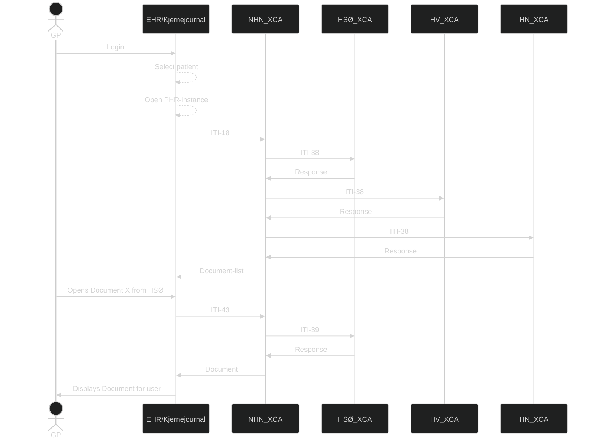

# Document sharing Overview - Actors and components 

The **XDS-architecture** consists of the following actors/components:
## Components
### Document source  
A document source is typically an **EHR-system** or backend solution which has produced or stores a document which will be shared using the **XDS-solution**.

### Document consumer  
A document consumer is typically a **EHR-system** (or citizen portal) which queries the **Document Source** for documents on a given patient.

### Document repository
A document repository is the service responsible for storing or making the document accessible. an **XDS-solution** can consist of one or more document repositories.

### Document Registry  
The Document Registry contains information (metadata) about all archived documents in the XDS area served by this document repository. An XDS site is always served by only one document repository, but a document repository can cover multiple XDS areas.
In addition to metadata about existing documents, the document register contains pointers to the document archive where the document is stored.

### Affinity Domain  
The concept of an Affinity Domain is, literally and figuratively, central in the realm of sharing health documents. The XDS-profile describes how documents are shared across enterprise boundaries within an Affinity Domain, as well as the rules that make sharing possible. An Affinity Domain has its own unique identifier, known as a **HomeCommunityID**. This ID is used when querying the domain.  
The boundaries of an Affinity Domain is not specified, but a logical separation within a country is natural. In Norway, this separation is on a **RHF** (Regionalt helseforetak)-level. This level of separation makes it possible for the Affinity Domains to profilings catered towards the needs of both the domain, aswell as the **RHF**.

### Patient identity source  
This component ensures every patient is given an **unambigous identificator**, for example a local, regional or nationwide population register.
>**🚩 National Extension**  In Norway, a personal identificator is in use (person number), so a dedicated service for handling patient identifications is not required.

## Document consuming process
Below is a diagram showing the process of retrieving the document-list and the document. Each affinity domain has its own XCA, which again has its own registry and repositories.  
When querying for a list of documentr , the Registry is queried, as it holds the metadata and references to the documents in the repository. When retrieving a document, the repository is queried with the ID from the Registry metadata item of interest.

*Simplified example on a query of document, each XCA is its own affinity domain, and the response for each domain may be different (ie. some domains reject requests from certain GP-roles)*
