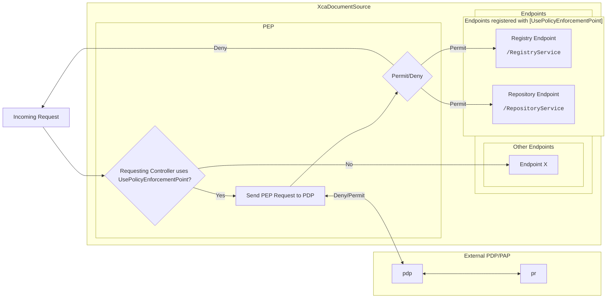

# Policy Enforcement Point
XcaDocumentSource features a setup for a Policy Enforcement Point, which is used to allow PAP/PDP system to access control a specific endpoint in XcaDocumentSource. It is based around [eXtensible Access Control Markup Language (XACML) Version 3.0 - docs.oasis-open.org ↗](https://docs.oasis-open.org/xacml/3.0/xacml-3.0-core-spec-cd-04-en.html) using the **abc.xacml**-library for .NET.  
[ABC.XACML - github ↗](https://github.com/abc-software/abc.xacml)  

## Using The Policy Enforcement Point With API-Controllers
The Policy Enforcement Point is registered as a **middleware-component** in the **ASP.NET Middleware Pipeline** and intercepts the requests before they enter the controllers endpoint.  
A custom attribute is used on each API controller to enable usage of the Policy Enforcement Point. Classes decorated with `[UsePolicyEnforcementPoint]` will go through the Policy Enforcement Point.

