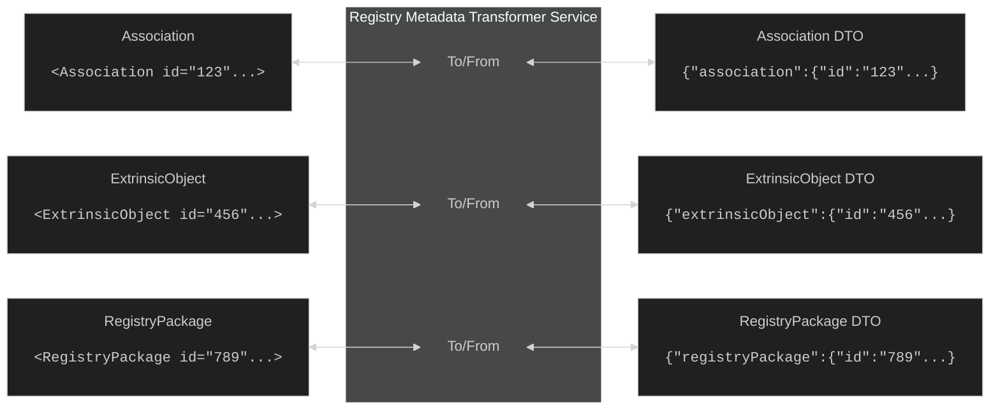

# Custom Document Registry Format
To get around the complexities of the metadata standards which ebRIM and IHE ITI infrastructure enforces, a custom data-structure is defined. It is made to correspond to the fields in the IHE Metadata, but does away with generic `<Classification>`, `<ExternalIdentifier>` and `<Slot>` types for simpler, less genric types.

## RegistryObjectDto overview
The RegistryObjectDto and its inheritants are used to store the registry metadata; in the reference implementation this is stored as a .json-file. The DTOs are made to closely resemble the ebRIM types they're abstracted from, but be more readable and easier to manage. Like the ebRIM types, a complete "Document Reference" contains:
* **Document Reference** - Metadata referencing the document (Document type, who made it etc.) 
* **Submission Set** - Metadata about the submission of the document (Who uploaded the document, what system/facility)
* **Association** - Binds the DocumentReference to the Submission Set, creating a document reference.

For more info on ebRIM types, see [SOAP-Message and SOAP-message formats](/Docs/XdsAndSoap.md)

The classes defining the structure are found in `<Solution>/XcaXds.Commons/Models/RegistryDtos`. 

### Custom JSON Serialization
Due to the polymorphic nature of the `RegistryObjectDto`-class, a custom JSON serializer needs to be used when serializing or deserializing data. The serializer can be found in `<Solution>/XcaXds.Commons/Commons.RegistryJsonSerializer.cs`

### Transforming between DTOs and ebRIM objects
Functions exist to translate the DTOs between DTO and ebRIM-types. It can be found in the `RegistryMetadataTransformerService`-class. 

## Registry Object Mappings (Custom classes to ebRIM/IHE XDS Metadata)
Fields are required according to the optionality of the ebRIM metadata.  
For more info on metadata, see [IHE XDS metadata - git.sarepta.ehelse.no ↗](https://git.sarepta.ehelse.no/publisert/standarder/raw/master/kravdokument/IHS_XDS_metadata/HIS%201169_2016%20IHE%20XDS%20metadata%20-oppdatert.pdf)



### DocumentEntryDto
The **DocumentEntryDto** represents an `ExtrinsicObject` in an XDS/XCA registry.  
It holds metadata about a clinical document such as its author, creation time, patient, format, and classification.  
This data structure is a key part of document registration and query responses in the [IHE ITI Technical Framework](https://profiles.ihe.net/ITI/TF/Volume3/ch-4.1.html).

#### Purpose
To describe a single clinical document’s metadata, aligned with the ebRIM `<ExtrinsicObject>` representation used in XDS/XCA registries.

#### ebRIM Mapping
Maps to an `<ExtrinsicObject>` in ebRIM, including:
| Property | Custom Type | ebRIM Equivalent | Description | ebRIM Opt. |
|---|---|---|---|---|
|Author|Author|`<Classification>` `XDSDocumentEntry.author` (`urn:uuid:93606bcf-9494-43ec-9b4e-a7748d1a838d`)|The Entity who created the document. Contains subtypes described below||
|Author.Organization|AuthorOrganization|`<Slot>` `authorOrganization` in Author `<Classification>` (XON)| The organization that created the document|R2|
|Author.Department|AuthorOrganization|`<Slot>` `authorDepartment` in Author `<Classification>` (XON)| The department that created the document|R2|
|Author.Person|AuthorPerson|`<Slot>` `authorPerson` in Author `<Classification>` (XCN)| The Person that created the document|R2|
|Author.Role|CodedValue|`<Slot>` `authorRole` in Author `<Classification>` (CX)| The Author Person's Role|O|
|Author.Speciality|CodedValue|`<Slot>` `authorSpeciality` in Author `<Classification>` (CX)| The Author Person's Speciality|O|
|AvailabilityStatus|String|`<ExtrinsicObject>` `status`-attribute| The status of the document entry (Approved or Deprecated)|R|
|ClassCode|CodedValue|`<Classification>` `XDSDocumentEntry.classCode` (`urn:uuid:41a5887f-8865-4c09-adf7-e362475b143a`)| The high-level type/group of document (can be related to TypeCode)|R|
|ConfidentialityCode|CodedValue|`<Classification>` `XDSDocumentEntry.confidentialityCode` (`urn:uuid:f4f85eac-e6cb-4883-b524-f2705394840f`)|The Confidentiality Code of the document, for access control|R|
|CreationTime|DateTime|`<Slot>` (`yyyyMMddHHmmss`-format)|The time the document was created|R|
|EventCodeList|CodedValue|`<Classification>` `XDSDocumentEntry.eventCodeList` (`urn:uuid:2c6b8cb7-8b2a-4051-b291-b1ae6a575ef4`)|The clinical procedure for the document.|O|
|FormatCode|CodedValue|`<Classification>` `XdsDocumentEntry.formatCode` (`urn:uuid:a09d5840-386c-46f2-b5ad-9c3699a4309d`)|The format of the document, usually defined in URN-format|R|
|Hash|string|`<Slot>` `hash`|The hash of the document bytes/content|R|
|HealthCareFacilityTypeCode|CodedValue|`<Classification>` `XDSDocumentEntry.healthcareFacilityTypeCode` (`urn:uuid:f33fb8ac-18af-42cc-ae0e-ed0b0bdb91e1`)|The type of healthcare facility that generated the metadata |R|
|HomeCommunityId|string|`<ExtrinsicObject>` `home`-attribute|The HomeCommunityId OID which the document entry originates from.|R|
|Id|string|`<ExtrinsicObject>` `id`-attribute|The ID of the document reference (Note! Not the ID of the actual document)|R|
|LanguageCode|string|`<Slot>` `languangeCode` (RFC 5646)|Language Code for the document language (RFC 5646-formatted)|R|
|LegalAuthenticator|LegalAuthenticator|`<Slot>` `legalAuthenticator` (XCN)|Name and Identification for the person or entity who approved or signed the document|R2|
|MimeType|string|`<ExtrinsicObject>` `mimeType`-attribute|Mime-type of the document|R|
|ObjectType|string|`<ExtrinsicObject>` `objectType`-attribute|Object-type of the document (Stable/On-demand document)|R|
|PatientId|CodedValue|`<ExternalIdentifier>` `XDSDocumentEntry.patientId` (`urn:uuid:58a6f841-87b3-4a3e-92fda8ffeff98427`) (CX)|The Unique identifiactor for the patient; national identifiers are commonly used|R|
|PracticeSettingCode|CodedValue|`<Classification>` `XDSDocumentEntry.practiceSettingCode` (`urn:uuid:cccf5598-8b07-4b77-a05e-2015ae952c785ead`)|The type of healthcare service available at the institution/department that created the metadata|R2|
|RepositoryUniqueId|string|`<Slot>` `repositoryUniqueId` |The repository OID where the document resides|R|
|ServiceStartTime|DateTime|`<Slot>` `serviceStartTime` (`yyyyMMddHHmmss`-format)|The time when the healthcare service started (ie. when the patient was admitted to the hospital)|R2|
|ServiceStopTime|DateTime|`<Slot>` `serviceStopTime` (`yyyyMMddHHmmss`-format)|The time when the healthcare service ended (ie. when the patients healthcare services were finished). <br>Left blank if service is ongoing when the document is created|R2|
|Size|string|`<Slot>` `size`|The size of the document, in bytes|R|
|SourcePatientInfo|SourcePatientInfo|`<Slot>` `sourcePatientId` and `<Slot>` `sourcePatientInfo`| Information about the patient, composed from the slots sourcePatientId and SourcePatientInfo|R|
SourcePatientInfo.PatientId|CodedValue|`<Slot>` `sourcePatientId`|The patient identifier, mapped from the `sourcePatientId`-slot.|R|
|Title|string|`<LocalizedString>`|The display title of the document|O|
|TypeCode|CodedValue| `<Classification>` (`urn:uuid:f0306f51-975f-434e-a61c-c59651d33983`) | The type of document (Discharge summary, test result etc.). Related to ClassCode|R|
|UniqueId|string|`<ExternalIdentifier>` `XDSDocumentEntry.uniqueId` (`urn:uuid:2e82c1f6-a085-4c72-9da3-8640a32e42ab`)|The Unique ID (Usually OID + identifier) for the document|R|

#### DocumentEntryDto Json Example
```json
{
"Author": {
    "Organization": {
    "Id": "983974880",
    "OrganizationName": "Finnmarkssykehuset HF",
    "AssigningAuthority": "2.16.578.1.12.4.1.4.101"
    },
    "Department": {
    "Id": "4211607",
    "OrganizationName": "Laboratoriemedisinsk avdeling - FIN",
    "AssigningAuthority": "2.16.578.1.12.4.1.4.102"
    },
    "Person": {
    "Id": "502116685",
    "FirstName": "BENEDIKTE",
    "LastName": "GEIRAAS",
    "AssigningAuthority": "urn:oid:2.16.578.1.12.4.1.4.4"
    },
    "Role": null,
    "Speciality": null
},
"AvailabilityStatus": "urn:oasis:names:tc:ebxml-regrep:StatusType:Approved",
"ClassCode": {
    "Code": "A00-1",
    "CodeSystem": "2.16.578.1.12.4.1.1.9602",
    "DisplayName": "Epikriser og sammenfatninger"
},
"ConfidentialityCode": {
    "Code": "NORN_DUP",
    "CodeSystem": "2.16.578.1.12.4.1.1.9603",
    "DisplayName": "Nektet, duplikat"
},
"CreationTime": "2025-02-06T14:13:56",
"EventCodeList": null,
"FormatCode": {
    "Code": "urn:ihe:iti:xds:2017:mimeTypeSufficient",
    "CodeSystem": "http://profiles.ihe.net/fhir/ihe.formatcode.fhir/CodeSystem-formatcode",
    "DisplayName": "urn:ihe:iti:xds:2017:mimeTypeSufficient"
},
"Hash": "35A3E0104791D9ACD5A16352ED075F390508CA10",
"HealthCareFacilityTypeCode": {
    "Code": "86.211",
    "CodeSystem": "2.16.578.1.12.4.1.1.1303",
    "DisplayName": "86.211"
},
"HomeCommunityId": "2.16.578.1.12.4.5.100.1",
"Id": "ExtrinsicObject01",
"LanguageCode": "nb-NO",
"LegalAuthenticator": null,
"MimeType": "application/xml",
"ObjectType": "urn:uuid:7edca82f-054d-47f2-a032-9b2a5b5186c1",
"PatientId": {
    "Code": "13116900216",
    "CodeSystem": "2.16.578.1.12.4.1.7.3.2.1",
    "DisplayName": null
},
"PracticeSettingCode": {
    "Code": "4",
    "CodeSystem": "2.16.578.1.12.4.1.1.8653",
    "DisplayName": "4"
},
"RepositoryUniqueId": "2.16.578.1.12.4.5.100.1.2",
"Size": "80574",
"ServiceStartTime": "2025-01-07T15:14:03",
"ServiceStopTime": "2025-01-22T15:14:03",
"SourcePatientInfo": {
    "PatientId": null,
    "GivenName": "Line",
    "FamilyName": "Danser",
    "BirthTime": "1969-11-13T00:00:00",
    "Gender": "F"
},
"Title": "test 123",
"TypeCode": {
    "Code": "A01-2",
    "CodeSystem": "2.16.578.1.12.4.1.1.9602",
    "DisplayName": "Kriseplan"
},
"UniqueId": null,
"DocumentUniqueId": "ExtrinsicObject01"
}
```

#### DocumentEntry ExtrinsicObject Xml Example
```xml
<ExtrinsicObject id="ExtrinsicObject01" 
    home="2.16.578.1.12.4.5.100.1" 
    objectType="urn:uuid:7edca82f-054d-47f2-a032-9b2a5b5186c1" 
    status="urn:oasis:names:tc:ebxml-regrep:StatusType:Approved" 
    mimeType="application/xml" 
    xmlns="urn:oasis:names:tc:ebxml-regrep:xsd:rim:3.0">
    <Slot name="creationTime">
        <ValueList>
            <Value>20250206141356</Value>
        </ValueList>
    </Slot>
    <Slot name="languageCode">
        <ValueList>
            <Value>nb-NO</Value>
        </ValueList>
    </Slot>
    <Slot name="sourcePatientId">
        <ValueList>
            <Value>13116900216^^^&amp;2.16.578.1.12.4.1.7.3.2.1&amp;ISO</Value>
        </ValueList>
    </Slot>
    <Slot name="serviceStartTime">
        <ValueList>
            <Value>20250107151403</Value>
        </ValueList>
    </Slot>
    <Slot name="serviceStopTime">
        <ValueList>
            <Value>20250122151403</Value>
        </ValueList>
    </Slot>
    <Slot name="sourcePatientInfo">
        <ValueList>
            <Value>PID-5|Danser^Line</Value>
            <Value>PID-7|19691113</Value>
            <Value>PID-8|F</Value>
        </ValueList>
    </Slot>
    <Slot name="hash">
        <ValueList>
        <Value>35A3E0104791D9ACD5A16352ED075F390508CA10</Value>
        </ValueList>
    </Slot>
    <Slot name="repositoryUniqueId">
        <ValueList>
            <Value>2.16.578.1.12.4.5.100.1.2</Value>
        </ValueList>
    </Slot>
    <Slot name="size">
        <ValueList>
            <Value>80574</Value>
        </ValueList>
    </Slot>
    <Name>
        <LocalizedString value="test 123" />
    </Name>
    <Classification id="47f72122-01af-4fdc-9aac-3528a7ed952e" 
        objectType="urn:oasis:names:tc:ebxml-regrep:ObjectType:RegistryObject:Classification" 
        classificationScheme="urn:uuid:93606bcf-9494-43ec-9b4e-a7748d1a838d" 
        classifiedObject="ExtrinsicObject01" 
        nodeRepresentation="">
        <Slot name="authorPerson">
            <ValueList>
                <Value>502116685^GEIRAAS^BENEDIKTE^^^^^^&amp;urn:oid:2.16.578.1.12.4.1.4.4&amp;ISO</Value>
            </ValueList>
        </Slot>
        <Slot name="authorInstitution">
            <ValueList>
                <Value>Finnmarkssykehuset HF</Value>
                <Value>Finnmarkssykehuset HF^^^^^&amp;2.16.578.1.12.4.1.4.101&amp;ISO^^^^983974880</Value>
                <Value>Laboratoriemedisinsk avdeling - FIN^^^^^&amp;2.16.578.1.12.4.1.4.102&amp;ISO^^^^4211607</Value>
            </ValueList>
        </Slot>
    </Classification>
    <Classification id="299a55b7-0466-4a85-ba5a-6ea0442677b1" 
        objectType="urn:oasis:names:tc:ebxml-regrep:ObjectType:RegistryObject:Classification" 
        classificationScheme="urn:uuid:93606bcf-9494-43ec-9b4e-a7748d1a838d" 
        classifiedObject="ExtrinsicObject01" 
        nodeRepresentation="">
        <Slot name="authorInstitution">
            <ValueList>
                <Value>Finnmarkssykehuset HF</Value>
                <Value>Finnmarkssykehuset HF^^^^^&amp;2.16.578.1.12.4.1.4.101&amp;ISO^^^^983974880</Value>
            </ValueList>
        </Slot>
    </Classification>
    <Classification id="eb031e63-9ba6-4a55-90ed-308e39cad7f8" 
        objectType="urn:oasis:names:tc:ebxml-regrep:ObjectType:RegistryObject:Classification" 
        classificationScheme="urn:uuid:a09d5840-386c-46f2-b5ad-9c3699a4309d" 
        classifiedObject="ExtrinsicObject01" 
        nodeRepresentation="urn:ihe:iti:xds:2017:mimeTypeSufficient">
        <Slot name="codingScheme">
        <ValueList>
            <Value>http://profiles.ihe.net/fhir/ihe.formatcode.fhir/CodeSystem-formatcode</Value>
        </ValueList>
        </Slot>
        <Name>
            <LocalizedString value="urn:ihe:iti:xds:2017:mimeTypeSufficient" />
        </Name>
    </Classification>
    <Classification id="161ad02a-5797-4526-8be9-a6bd696ad2d5" 
        objectType="urn:oasis:names:tc:ebxml-regrep:ObjectType:RegistryObject:Classification" 
        classificationScheme="urn:uuid:f33fb8ac-18af-42cc-ae0e-ed0b0bdb91e1" 
        classifiedObject="ExtrinsicObject01" 
        nodeRepresentation="86.211">
        <Slot name="codingScheme">
        <ValueList>
            <Value>2.16.578.1.12.4.1.1.1303</Value>
        </ValueList>
        </Slot>
        <Name>
            <LocalizedString value="86.211" />
        </Name>
    </Classification>
    <Classification id="f2db7879-aed7-4757-bdc6-624f4d0675ad" 
        objectType="urn:oasis:names:tc:ebxml-regrep:ObjectType:RegistryObject:Classification" 
        classificationScheme="urn:uuid:cccf5598-8b07-4b77-a05e-ae952c785ead" 
        classifiedObject="ExtrinsicObject01" 
        nodeRepresentation="4">
        <Slot name="codingScheme">
        <ValueList>
            <Value>2.16.578.1.12.4.1.1.8653</Value>
        </ValueList>
        </Slot>
        <Name>
            <LocalizedString value="4" />
        </Name>
    </Classification>
    <Classification id="ee748ec0-7265-431f-9cce-ff3901548508" 
        objectType="urn:oasis:names:tc:ebxml-regrep:ObjectType:RegistryObject:Classification" 
        classificationScheme="urn:uuid:41a5887f-8865-4c09-adf7-e362475b143a" 
        classifiedObject="ExtrinsicObject01" 
        nodeRepresentation="A00-1">
        <Slot name="codingScheme">
        <ValueList>
            <Value>2.16.578.1.12.4.1.1.9602</Value>
        </ValueList>
        </Slot>
        <Name>
            <LocalizedString value="Epikriser og sammenfatninger" />
        </Name>
    </Classification>
    <Classification id="81a47ff0-3d30-4572-94a4-e71069925df6" 
        objectType="urn:oasis:names:tc:ebxml-regrep:ObjectType:RegistryObject:Classification" 
        classificationScheme="urn:uuid:f0306f51-975f-434e-a61c-c59651d33983" 
        classifiedObject="ExtrinsicObject01" 
        nodeRepresentation="A01-2">
        <Slot name="codingScheme">
        <ValueList>
            <Value>2.16.578.1.12.4.1.1.9602</Value>
        </ValueList>
        </Slot>
        <Name>
            <LocalizedString value="Kriseplan" />
        </Name>
    </Classification>
    <Classification id="76626fbe-8828-4b6a-bc64-9d4f8ccddec0" 
        objectType="urn:oasis:names:tc:ebxml-regrep:ObjectType:RegistryObject:Classification" 
        classificationScheme="urn:uuid:f4f85eac-e6cb-4883-b524-f2705394840f" 
        classifiedObject="ExtrinsicObject01" 
        nodeRepresentation="NORN_DUP">
        <Slot name="codingScheme">
        <ValueList>
            <Value>2.16.578.1.12.4.1.1.9603</Value>
        </ValueList>
        </Slot>
        <Name>
            <LocalizedString value="Nektet, duplikat" />
        </Name>
    </Classification>
    <ExternalIdentifier id="97662f6d-7271-4ef8-b9ca-9fd054527c06" 
        objectType="urn:oasis:names:tc:ebxml-regrep:ObjectType:RegistryObject:ExternalIdentifier" 
        registryObject="ExtrinsicObject01" 
        identificationScheme="urn:uuid:2e82c1f6-a085-4c72-9da3-8640a32e42ab" 
        value="ExtrinsicObject01">
        <Name>
            <LocalizedString value="XDSDocumentEntry.uniqueId" />
        </Name>
    </ExternalIdentifier>
    <ExternalIdentifier id="df0a5ea1-d5ae-4a26-b1f0-abc0e33ff04a" 
        objectType="urn:oasis:names:tc:ebxml-regrep:ObjectType:RegistryObject:ExternalIdentifier" 
        registryObject="ExtrinsicObject01" 
        identificationScheme="urn:uuid:58a6f841-87b3-4a3e-92fd-a8ffeff98427" 
        value="13116900216^^^&amp;2.16.578.1.12.4.1.7.3.2.1&amp;ISO">
        <Name>
            <LocalizedString value="XDSDocumentEntry.patientId" />
        </Name>
    </ExternalIdentifier>
</ExtrinsicObject>
```

### SubmissionSetDto
Represents a submission set in the XDS/XCA registry (`<RegistryPackage>` in ebXML). Used to group one or more documents together with metadata about the submission.

#### Purpose
To encapsulate metadata about the submission event — who submitted it, when, for which patient, etc.

#### XML/ebRIM Mapping
Maps to `<RegistryPackage>` in ebRIM, including nested `<Classification>`, `<Slot>`, and `<ExternalIdentifier>` elements.

| Property | Custom Type | ebRIM Equivalent | Description | ebRIM Opt. |
|---|---|---|---|---|
|Author|Author|`<Classification>` `XDSSubmissionSet.author` (`urn:uuid:a7058bb9-b4e4-4307-ba5b-e3f0ab85e12d`)|The Entity who created the document. Contains subtypes described below||
|Author.Organization|AuthorOrganization|`<Slot>` `authorOrganization` in Author `<Classification>` (XON)| The organization that created the document|R2|
|Author.Department|AuthorOrganization|`<Slot>` `authorOrganization` in Author `<Classification>` (XON)| The department that created the document|R2|
|Author.Person|AuthorPerson|`<Slot>` `authorPerson` in Author `<Classification>` (XCN)| The Person that created the document|R2|
|Author.Role|CodedValue|`<Slot>` `authorRole` in Author `<Classification>` (CX)| The Author Person's Role|O|
|Author.Speciality|CodedValue|`<Slot>` `authorSpeciality` in Author `<Classification>` (CX)| The Author Person's Speciality|O|
|AvailabilityStatus|String|`<RegistryPackage>` `status`-attribute| The status of the submission set (Approved or Deprecated)|R|
|HomeCommunityId|string|`<RegistryPackage>` `home`-attribute|The HomeCommunityId OID which the submission set originates from.|R|
|Id|string|`<RegistryPackage>` `id`-attribute|Id of the submission set|
|PatientId|CodedValue|`<ExternalIdentifier>` `XDSSubmissionSet.patientId` (`urn:uuid:6b5aea1a-874d-4603-a4bc-96a0a7b38446`) (CX)|The Unique identifiactor for the patient; national identifiers are commonly used|R|
|SubmissionTime|DateTime|Slot (`yyyyMMddHHmmss`)|Timestamp when the document was submitted|
|Title|string|`<LocalizedString>`|The display title of the document|O|
|UniqueId|string|`<ExternalIdentifier>` `XDSDocumentEntry.uniqueId` (`urn:uuid:2e82c1f6-a085-4c72-9da3-8640a32e42ab`)|The Unique ID (Usually OID + identifier) for the document|R|
|SourceId|string|`<ExternalIdentifier>` `XDSSubmissionSet.sourceId` (`urn:uuid:554ac39e-e3fe-47fe-b233-965d2a147832`)|The OID of the authority/system submitting the document.|R|

#### SubmissionSetDto Json Example
```json
{
"Author": {
    "Organization": {
        "Id": "",
        "OrganizationName": "Berea Community",
        "AssigningAuthority": ""
    },
    "Department": null,
    "Person": {
        "Id": null,
        "FirstName": "Sherry",
        "LastName": "Dopplemeyer",
        "AssigningAuthority": null
    },
    "Role": {
        "Code": "Pry Surgon",
        "CodeSystem": null,
        "DisplayName": null
    },
    "Speciality": {
        "Code": "Orthopedic",
        "CodeSystem": null,
        "DisplayName": null
    }
},
"AvailabilityStatus": null,
"ContentTypeCode": {
    "Code": "History and Physical",
    "CodeSystem": "Connect-a-thon contentTypeCodes",
    "DisplayName": "History and Physical"
},
"HomeCommunityId": null,
"Id": "SubmissionSet02",
"PatientId": {
    "Code": "SELF-5",
    "CodeSystem": "1.3.6.1.4.1.21367.2005.3.7",
    "DisplayName": null
},
"SubmissionTime": "2004-12-25T23:50:50",
"Title": "Physical",
"UniqueId": "1.3.6.1.4.1.21367.2005.3.9999.33",
"SourceId": "3670984664"
}
```

#### SubmissionSet RegistryPackage Xml
```xml
<RegistryPackage 
    id="SubmissionSet02"
    xmlns="urn:oasis:names:tc:ebxml-regrep:xsd:rim:3.0">
    <Slot name="submissionTime">
        <ValueList>
            <Value>20041225235050</Value>
        </ValueList>
    </Slot>
    <Name>
        <LocalizedString value="Physical" />
    </Name>
    <Description>
        <LocalizedString value="Annual physical" />
    </Description>
    <Classification id="cl08" 
        assificationScheme="urn:uuid:a7058bb9-b4e4-4307-ba5b-e3f0ab85e12d" 
        assifiedObject="SubmissionSet02">
        <Slot name="authorPerson">
            <ValueList>
                <Value>Sherry Dopplemeyer</Value>
            </ValueList>
        </Slot>
        <Slot name="authorInstitution">
            <ValueList>
                <Value>Cleveland Clinic</Value>
                <Value>Berea Community</Value>
            </ValueList>
        </Slot>
        <Slot name="authorRole">
            <ValueList>
                <Value>Pry Surgon</Value>
            </ValueList>
        </Slot>
        <Slot name="authorSpecialty">
            <ValueList>
                <Value>Orthopedic</Value>
            </ValueList>
        </Slot>
    </Classification>
    <Classification id="cl09" 
        classificationScheme="urn:uuid:aa543740-bdda-424e-8c96-df4873be8500" 
        classifiedObject="SubmissionSet02" 
        nodeRepresentation="History and Physical">
        <Slot name="codingScheme">
            <ValueList>
                <Value>Connect-a-thon contentTypeCodes</Value>
            </ValueList>
        </Slot>
        <Name>
            <LocalizedString value="History and Physical" />
        </Name>
    </Classification>
    <ExternalIdentifier id="ei03" 
        registryObject="SubmissionSet02" 
        identificationScheme="urn:uuid:96fdda7c-d067-4183-912e-bf5ee74998a8" 
        value="1.3.6.1.4.1.21367.2005.3.9999.33">
        <Name>
            <LocalizedString value="XDSSubmissionSet.uniqueId" />
        </Name>
    </ExternalIdentifier>
    <ExternalIdentifier id="ei04" 
        registryObject="SubmissionSet02" 
        identificationScheme="urn:uuid:554ac39e-e3fe-47fe-b233-965d2a147832" 
        value="3670984664">
        <Name>
            <LocalizedString value="XDSSubmissionSet.sourceId" />
        </Name>
    </ExternalIdentifier>
    <ExternalIdentifier id="ei05" 
        registryObject="SubmissionSet02" 
        identificationScheme="urn:uuid:6b5aea1a-874d-4603-a4bc-96a0a7b38446" 
        value="SELF-5^^^&amp;1.3.6.1.4.1.21367.2005.3.7&amp;ISO">
        <Name>
            <LocalizedString value="XDSSubmissionSet.patientId" />
        </Name>
    </ExternalIdentifier>
</RegistryPackage>
  ```

### AssociationDto
Represents an association `<Association>`-XML type, often used to create a link between an `<ExtrinsicObject>` Document Entry and a `<RegistryPackage>` Submission Set.

| Property | Custom Type | ebRIM Equivalent | Description |
|---|---|---|---|
|AssociationType|string|`<Association>` `associationType`-attribute|The type of association between the SourceObject and TargetObject, represented as an URN.|
|SourceObject|string|`<Association>` `sourceObject`-attribute|The Identifier for the Source Object related to this association|
|SubmissionSetStatus|string|`<Slot>` `submissionSetStatus`|The status of this association|
|TargetObject|string|`<Association>` `targetObject`-attribute|The Identifier for the Target Object related to this association|
|Id|string|`<Association>` `id`-attribute|The Identifier for the association|

#### AssociationDto Json Example

```json
{
    "AssociationType": "urn:oasis:names:tc:ebxml-regrep:AssociationType:HasMember",
    "SourceObject": "RegistryPackage01",
    "SubmissionSetStatus": "Original",
    "TargetObject": "ExtrinsicObject01",
    "Id": "Association01"
}
```

#### Association XML example
```xml
<Association id="83fc4c14-5099-4ded-a7b1-1c4847de7ce3" 
    objectType="urn:oasis:names:tc:ebxml-regrep:ObjectType:RegistryObject:Association" 
    associationType="urn:oasis:names:tc:ebxml-regrep:AssociationType:HasMember" 
    sourceObject="RegistryPackage01" 
    targetObject="ExtrinsicObject01">
    <Slot name="SubmissionSetStatus">
        <ValueList>
            <Value>Original</Value>
        </ValueList>
    </Slot>
</Association>
```