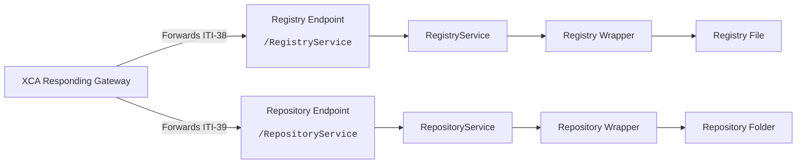

# Technical Implementation Details

## Appsettings.json-file
The **XcaXds.WebService** solution has an **appsettings.json**-file (found in `<solution>/XcaXds.WebService/appsettings.json`) which defines parameters used by the XcaDocumentSource solution as a whole. The **OIDs** for the **HomecommunityId** and **RepositoryId** is defined and can be changed there if nescesarry.

## Document Registry/Repository Solution
The Document Registry/Repository-solution is created to be easily interchangeable with existing Document Source solutions. It is based on a simple file-based Registry and Repository, where the Document Registry is a XML-file with a 1:1 representation of the metadata returned in **ITI-messages**.
A RegistryService is registered with Dependency Injection, which holds an instance of the Document Registry. When a document is uploaded or deleted using one of **ITI-41**, **ITI-42** or **ITI-62**, the DI-instance of the Registry is updated to correspond to the modifications made.  
If the **Registry.xml** file is edited directly by hand, such as using a text-editor, the application must be restarted or "bumped" by uploading or deleting registry objects with an **ITI-message**, thus triggering an update to the DI-instance.

## Registry/Repository Wrapper
The Registry and RepositoryWrapper-services (found in `<solution>/XcaXds.Source/Services/RegistryService.cs`) are wrappers for the actual Registry/Repository Implementation.  
When an implementor wants to connect XcaDocumentSource to their existing Registry/Repostiory solution, it should theoretically only be nescesarry to modify this file to correspond to the structure expected from the existing registry solution, although further modifications may be nescesarry.  
The OID for the folder is the Repository-Id as defined in the **appsettings.json**-file and is created automatically when a document is uploaded. The document  
## Architecture

#### Default API Routes
| Endpoint | Method
|---|---|
| `<baseurl>/hl7/search-patients` | POST