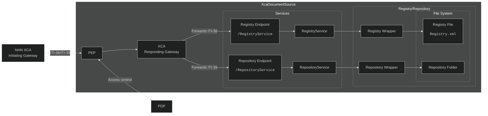
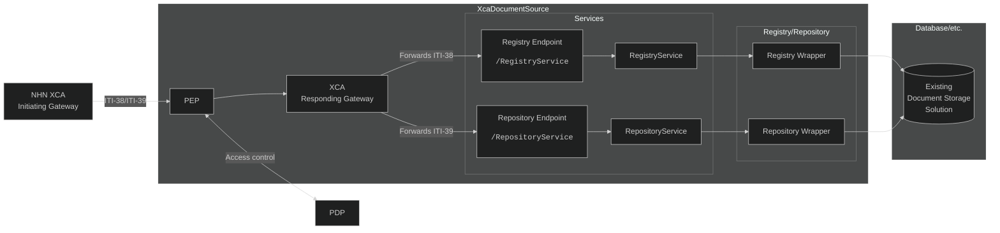
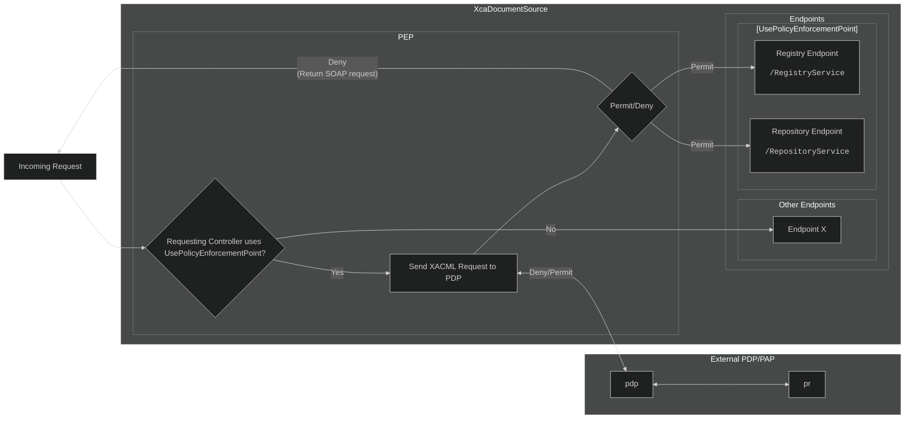

# Technical Implementation Details

## Appsettings.json-file
The **XcaXds.WebService**-solution has an **appsettings.json**-file (found in `<solution>/XcaXds.WebService/appsettings.json`). The section `XdsConfiguration` defines parameters which are used by the XcaDocumentSource solution as a whole.  
The **OIDs** for the **HomecommunityId** and **RepositoryId** is defined and can be changed there if nescesarry.


## Document Registry/Repository Solution
The Document Registry/Repository-solution is created to be easily interchangeable with existing Document Source solutions. It is based on a simple file-based Registry and Repository.  
The Document Registry is a XML-file with a 1:1 representation of the serialized document metadata, such as what is returned in **ITI-messages**.
A RegistryService is registered with Dependency Injection (DI), which holds an instance of the Document Registry. When a document is uploaded or deleted using one of **ITI-41**, **ITI-42** or **ITI-62**, the DI-instance of the Registry is updated to correspond to the modifications made. 
> **⚠️ Note!** <br> If the **Registry.xml** file is edited directly by hand, such as using a text-editor, the application must be restarted or "bumped" by uploading or deleting registry objects with an **ITI-message**, thus triggering an update to the DI-instance.

## Registry/Repository Wrapper
The Registry and RepositoryWrapper-services (at `<solution>/XcaXds.Source/Services/RegistryWrapper.cs`) are wrappers for the actual Registry/Repository Implementation.
When an implementer wants to connect XcaDocumentSource to an existing Registry/Repostiory solution, it should theoretically only be nescesarry to modify this file to correspond to the structure expected from the existing registry solution, although further modifications may be nescesarry.  
The OID for the folder is the Repository-Id as defined in the **appsettings.json**-file and is created automatically when a document is first uploaded.  
The unique ID of the document is represented as the file-system name of the file.


## Base architecture
Below is a diagram of the architecture out of the box.

*Out-of-the-box solution architecture*

## Example architecture
Below is an example of how an implementer would have modified Registry and Repository-wrappers to connect to an existing document storage solution.

*Modified solution to target existing document storage solution*

## Policy Enforcement Point
**XcaDocumentSource** features a setup for a Policy Enforcement Point, which is used to allow PAP/PDP system to access control a specific endpoint in **XcaDocumentSource**. It is based around [eXtensible Access Control Markup Language (XACML) Version 3.0 - docs.oasis-open.org ↗](https://docs.oasis-open.org/xacml/3.0/xacml-3.0-core-spec-cd-04-en.html) using the **abc.xacml**-library for .NET.  
[ABC.XACML - github ↗](https://github.com/abc-software/abc.xacml)  
### Using The Policy Enforcement Point With API-Controllers
The Policy Enforcement Point is registered as a **middleware-component** in the **ASP.NET Middleware Pipeline** and intercepts the requests before they enter the controllers endpoint.
An extension method is also used to define it in the applications `Program.cs`-file, similar to other components.
```c#
app.UsePolicyEnforcementPointMiddleware();
```
*Excerpt from XcaXds.WebService's `Program.cs`-file*  

A custom attribute is used on each API controller to enable usage of the Policy Enforcement Point. Classes decorated with `[UsePolicyEnforcementPoint]` will go through the Policy Enforcement Point middleware (`PolicyEnforcementPointMiddlware.cs`).


*Flow-diagram of Policy Enforcement Point*