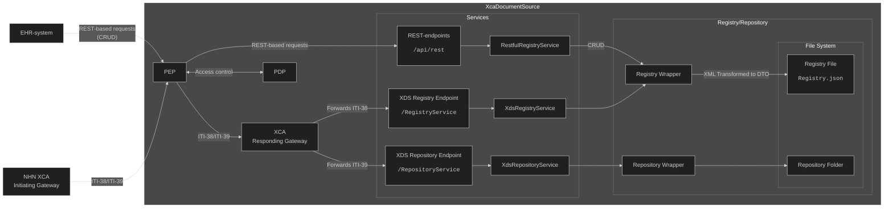
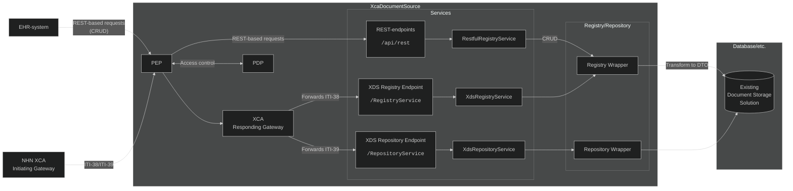

# Technical Implementation Details

## Document Registry/Repository Solution
The Document Registry/Repository-solution is created to be easily interchangeable with existing Document Source solutions. It is based on a simple file-based Registry and Repository.  
The Document Registry is a XML-file with a 1:1 representation of the serialized document metadata, such as what is returned in **ITI-messages**.
A RegistryService is registered with Dependency Injection (DI), which holds an instance of the Document Registry. When a document is uploaded or deleted using one of **ITI-41**, **ITI-42** or **ITI-62**, the DI-instance of the Registry is updated to correspond to the modifications made. 
>**🔶 Implementation Note**   If the **Registry.json** file is edited directly by hand, such as using a text-editor, the application must be restarted or "bumped" by uploading or deleting registry objects with a registry request, thus triggering an update to the DI-instance.

## IDocumentRegistry/IRepository
The IDocumentRegistry and IRepository (at `<solution>/XcaXds.Source/Services/`) are the actual Registry/Repository Implementation. The base implementation is file-based.  
The documents are stored in a folder named after the Repository-Id OID (Object Identifier) as defined in the **appsettings.json**-file and is created automatically when a document is first uploaded.  
The unique ID of the document is represented as the file-system name of the file.
  
When an implementer wants to connect XcaDocumentSource to an existing Registry/Repostiory solution, it should theoretically be nescesarry to create a new implementation of the IDocumentRegistry and/or IRepository-interfaces, and plug them into the implementation defined in the `Program.cs` of `XcaXds.WebService`-solution. Note that further modifications may be nescesarry.  

## Base architecture
Below is a diagram of the architecture out of the box.

*Out-of-the-box solution architecture*

## Example architecture
Below is an example of how an implementer would have modified Registry and Repository-wrappers to connect to an existing document storage solution.

*Modified solution to target existing document storage solution*

## Access Control (Policy Enforcement Point)
**XcaDocumentSource** features a setup for a  **PEP** **(Policy Enforcement Point)**, which is used to allow PAP/PDP system to access control a specific endpoint in **XcaDocumentSource**. It is based around [eXtensible Access Control Markup Language (XACML) Version 3.0 - docs.oasis-open.org ↗](https://docs.oasis-open.org/xacml/3.0/xacml-3.0-core-spec-cd-04-en.html) using the **abc.xacml**-library for .NET.  
[ABC.XACML - github ↗](https://github.com/abc-software/abc.xacml)  
>For more information, [See Access Control](AccessControl.md)

## Appsettings.json-file
The **XcaXds.WebService**-solution has an **appsettings.json**-file (found in `<solution>/XcaXds.WebService/appsettings.json`). The section `XdsConfiguration` defines parameters which are used by the XcaDocumentSource solution as a whole. This also hosts global parameters and settings such as Document size limit and whether to include multipart response when retreiving document.
The **OIDs** for the **HomecommunityId** and **RepositoryId** is also defined there and can be changed if nescesarry.
