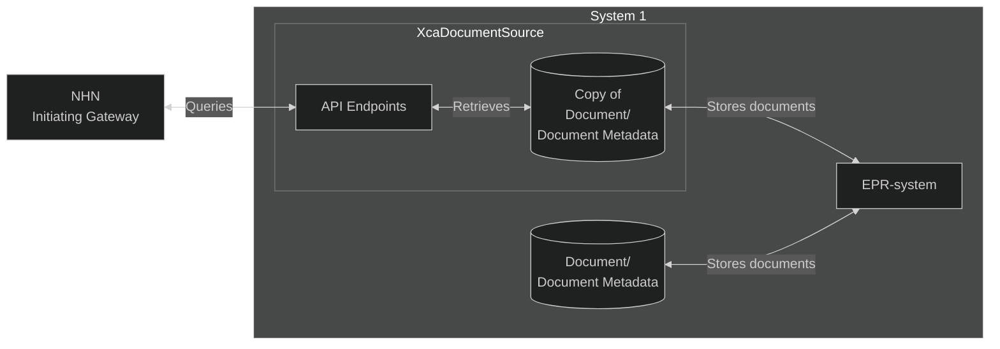

# Use case Scenarios for PJD.XcaDocumentSource

## Use cases

### 1. Municipality Sharing Test Results with National Health Network

#### Scenario: 
A municipality’s health department wants to publish lab test results (e.g., COVID-19, bloodwork) from its internal system to the national XCA infrastructure, so they’re available to hospitals and general practitioners (GPs).

#### Use Case Flow:
* The municipality pushes documents into a local repository or document registry.
* The municipality adapts PJD.XcaDocumentSource to talk to their local registry or repository. 
* GPs can search and retrieve these documents via the national XCA gateway.

#### Benefits:
Eliminates siloed data. Test results are accessible to any authorized healthcare professional in the country.

*Municipality sharing documents via XcaDocumentSource*

### 2. Hospital Sharing copy of all documents and metadata to XcaDocumentSource

#### Scenario:
A hospital wants to share documents using XcaDocumentSource, but their storage solution does not allow for easy transformation and fetching of data.  
**Solution:** All documents uploaded to the EPR's storage solution is also uploaded to XcaDocumentSource's storage solution

#### Use Case Flow:
* After discharge, the hospital’s EPR system sends a CDA discharge summary.
* PJD.XcaDocumentSource registers it with the national XCA infrastructure.
* GPs and municipal care teams query and retrieve the document seamlessly.

#### Benefits:
Ensures continuity of care and informed follow-up treatment.

*Municipality sharing documents via XcaDocumentSource*

### 3. Private Specialist Making Consult Notes Available to Hospitals

#### Scenario:
A private dermatologist or cardiologist needs to ensure that their consult findings are accessible to the referring hospital or emergency department.

#### Use Case Flow:
* Specialist uploads or sends consult note (CDA, PDF) to the integration system.
* Integration with PJD.XcaDocumentSource makes the document available with appropriate access rights.
* Hospitals query using the national gateway and retrieve the documents.

#### Benefit:
Reduces duplicated effort, supports informed emergency care.
