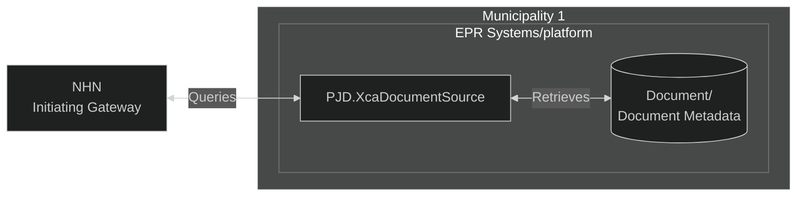

# Use case Scenarios for PJD.XcaDocumentSource

## Preface: The vision of PJD.XcaDocumentSource
<span style="color:yellow">**Important Note!** ⚠ <br>**PJD.XcaDocumentSource** is provided as an open-source reference for the implementer to extend or customize its interfaces to align with the requirements of their existing Electronic Patient Record (EPR) systems.  
The solution is **not** a substitute for an EPR system nor an EPR storage solution; it acts as a translating framework between SOAP messages from NHN's XCA and the implementers **existing** EPR-system.<br><br></span>
<span style="color:red">
**Norsk helsenett (NHN) does not assume responsibility for the integrity, availability, or confidentiality of patient data handled through deployments based on PJD.XcaDocumentSource. Use of PJD.XcaDocumentSource is at the implementer's own risk, and any integration between PJD.XcaDocumentSource and live Electronic Patient Record (EPR) systems must be thoroughly tested and validated within the implementer’s own governance and compliance frameworks.**</span>

**PJD.XcaDocumentSource** allows healthcare providers to expose their internal, **existing document storage solution** as an **XDS-compliant Registry** and **Repository** interface.  
The solution serves as a protocol adapter layer that abstracts **SOAP**, **ebXML**, and **ebRIM** formatted messages behind a simplified **RESTful API layer**. This significantly reduces integration friction with an actor's existing storage solution, by translating complex ITI messages into implementation-defined, simplified internal representations suitable for integration with custom document APIs.

* Implements IHE XCA profile for cross-community access
* Provides an XDS.b-compatible registry and repository layer backed by customizable storage adapters
* Supports integration with Norsk Helsenett’s XCA Initiating Gateway

**PJD.XcaDocumentSource** does not provide document storage itself. Instead, it allows implementers to connect their own storage infrastructure - whether proprietary, legacy, or standards-based—by implementing custom translation logic between document storage metadata and the simpler, internal data-structures.
```
 [External XCA Initiating Gateway]
             ↓ ITI-38/39
  [XcaDocumentSource Translation Layer, simple data structures]
             ↓ Custom Adapter Interface (Written by the implementer)
     [Existing Document Storage Backend]
```

It aims to accelerate prototyping and integration with NHN, without requiring full knowledge of **IHE profiles** and **ebXML RegRep** specifications up-front; the solution handles the complexities of SOAP and XML, essentially "doing the plumbing work". This allows the end user to focus on their domain-specific implementations needs, like shaping business logic and handling access control.

Architecturally, **PJD.XcaDocumentSource** acts as a translation gateway that sits between an external XCA Initiating Gateway (e.g., NHN) and an organization’s internal EPR system, mapping IHE protocols to local API semantics

## Use cases

### 1. Municipality Sharing Test Results with National Health Network

#### Scenario: 
A municipality’s health department wants to publish lab test results (e.g., COVID-19, bloodwork) from its internal system to the national XCA infrastructure, so they’re available to hospitals and general practitioners (GPs).

#### Use Case Flow:
* The municipality pushes documents into a local repository or document registry.
* The municipality adapts PJD.XcaDocumentSource to talk to their local registry or repository. 
* GPs can search and retrieve these documents via the national XCA gateway.

#### Benefits:
Eliminates siloed data. Test results are accessible to any authorized healthcare professional in the country.


*Municipality sharing documents via XcaDocumentSource*

### 2. Hospital Sharing Discharge Summaries with GPs and Home Care Providers

#### Scenario:
A hospital wants to make discharge notes and care plans available to the patient’s general practitioner and municipal home care team.

#### Use Case Flow:
* After discharge, the hospital’s EPR system sends a CDA discharge summary.
* PJD.XcaDocumentSource registers it with the national XCA infrastructure.
* GPs and municipal care teams query and retrieve the document seamlessly.

#### Benefits:
Ensures continuity of care and informed follow-up treatment.

### 3. Private Specialist Making Consult Notes Available to Hospitals

#### Scenario:
A private dermatologist or cardiologist needs to ensure that their consult findings are accessible to the referring hospital or emergency department.

#### Use Case Flow:
* Specialist uploads or sends consult note (CDA, PDF) to the integration system.
* Integration with PJD.XcaDocumentSource makes the document available with appropriate access rights.
* Hospitals query using the national gateway and retrieve the documents.

#### Benefit:
Reduces duplicated effort, supports informed emergency care.
