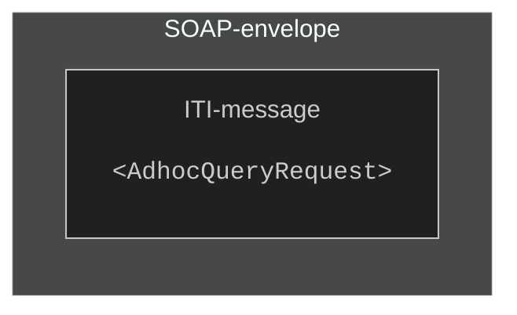
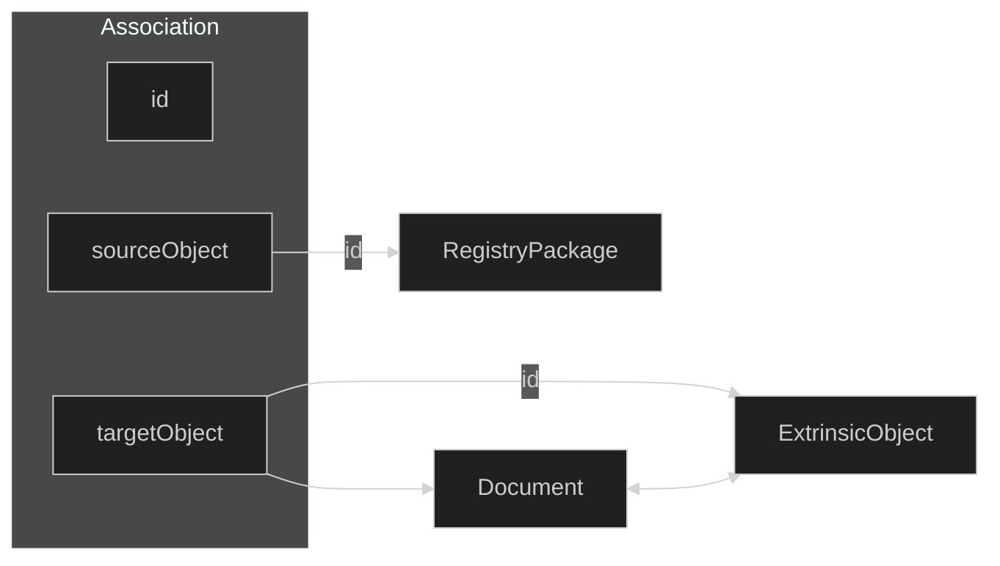

# SOAP-Message and SOAP-message formats  
An **XML SOAP-message** (also known as **SOAP-envelope**) is defined by an enclosing `<Envelope>`-tag and a `<Header>` and `<Body>` tag. The Header holds information about the request in the Body, such as the Action performed.
**SOAP-messages** are commonly transmitted over **HTTPS** as a `POST`-request, with the **SOAP message** as the request payload.

## Sample SOAP-message
```xml
<Envelope>
    <Header>
        <Action>urn:ihe:iti:2007:RegistryStoredQuery</Action>
        <MessageId>12345678-abcd-efab-cdef-123456789abc</MessageId>
        <Security>
            [SAML-token]
        </Security>
    </Header>  
    <Body>
        <!-- Content in body is expected to adhere with <Action> -->
        <AdhocQueryRequest>
            [Request]
        </AdhocQueryRequest>
    </Body>
</Envelope>
```
*Example SOAP-envelope. Namespaces are omitted for clarity*

There is excpected to be a **1:1 relationship** between the **SOAP action** (`<Action>`-field in the **SOAP-header**) and the content in the request `<Body>` (`<AdhocQueryRequest>` in this case)

## SOAP-Envelope and `<Body>`-content
The content of the body might seem like it's related to the SOAP-body itself, but they are not the same. In the example above, the `<AdhocQueryRequest>` XML-part is called the ITI-message, while the rest is the SOAP-envelope. It can be abstracted to this:

*ITI-message inside a SOAP-envelope*

## Terminology in Document sharing
| Term  | Definition | Example |
|---|---|---|
| Assigning Authority | Used in conjunction with metadata. Consists of an unique identifier for the organization or system responsible for governing or producing said data. Also used for defining the format of the data. | `13116900216^^^&amp;2.16.578.1.12.4.1.4.1&amp;ISO` <br> *Here the **OID** identifies the **assigning authority** for defining what the numbers `13116900216` represent (`<Birth-number>^^^<OID defining birth numbers>`)*  |
| Code System | A Code System defines a set of coded values that can be used in XDS metadata, such as document types, healthcare facility types, and event codes  | `codeSystem="urn:oid:2.16.578.1.12.4.1.1.9060"` |
| Code System Name | The name of a specific code system | `codeSystemName="Kategori helsepersonell"` |
| OID | Object Identifier - Used to identify a single organization or system | `2.16.578.1.12.4.1.7` |
| TBD |  | `TBD` |

*terminology used for types in IHE XDS*  

## Types in IHE XDS  
There are different types used to contain and structure various pieces when storing and making documents available. It's imperative that the reader familiarizes themself with each type and where they usually reside in a **SOAP-message**.  
The types can be abstracted to this diagram, showing how Document Sharing Objects contain metadata types, which in turn contains coded values in specific formats.

```c#
[Document Sharing Objects]
    [Metadata Types]
        [Coded Values]      :: String
        [Data]              :: String
        [HL7 Data Types]    :: String
```
*Generalized structure of data types in document sharing*


### Document Sharing Objects  
Some of the **XML Types** described below can be used to represent different concepts.  
The table below describes the different types.  

| Document Sharing Object/Association  | XML Type representation |
|---|---|
| DocumentEntry	 | `<ExtrinsicObject>` |
| SubmissionSet | `<RegistryPackage>` |
| Folder | `<RegistryPackage>` |
| HasMember | `<Association>` |
| MemberOf | `<Association>` |
| Relationship | `<Association>` |

*Document Sharing concept correspondence with XML Types*

#### SubmissionSet
A SubmisisonSet contains the details about all resources related to a specific document. Through Associations, other objects like Folders and DocumentEntries are linked to the submission set.
More about SubmissionSet [4.1.1.1 SubmissionSet - profiles.ihe.net ↗](https://profiles.ihe.net/ITI/TF/Volume3/ch-4.1.html#4.1.1.1)

#### Association
Associations are links between a source objects and target object, such as a DocumentEntry and a SubmissionSet
More about Associations [4.1.2 Association Types - profiles.ihe.net ↗](https://profiles.ihe.net/ITI/TF/Volume3/ch-4.1.html#4.1.2)

#### DocumentEntry
**DocumentEntry** contains attributes describing a document. It contains information about who created the document, what type of document it is, and where to retrieve it. **It does not contain the document itself**, as the documents reside in the **Document Repository**. **DocumentEntries** can differ based on the **XDS profile**, and can have state of `On-Demand` or `Stable`

More about Documententry [4.1.1.3 DocumentEntry - profiles.ihe.net ↗](https://profiles.ihe.net/ITI/TF/Volume3/ch-4.1.html#4.1.1.3)

#### Folder
>**🚩 National Extension**<br> Folders are not required, nor widely used in Document Sharing in Norway. For conformancy reasons, **PJD.XcaDocumentSource** has support for storing and retrieving folders.

A folder is a collection of DocumentEntry-objects that are related in some way, creating an arbitrary grouping relationship. Folder may be used to collect the DocumentEntry objects for the patient’s documents that relate to an exam event, such as the exam request and prior results as well as the eventual exam results.

More about Folders [4.1.1.2 Folder - profiles.ihe.net ↗](https://profiles.ihe.net/ITI/TF/Volume3/ch-4.1.html#4.1.1.2)


### HL7 Data types  
**All data types are represented as a string literal and are contained within other types**. Some might contain special characters, denoting a structure.  
The most commonly used data structure in document sharing in Norway are **HL7 data types**.  
Several data types are used in document sharing in Norway, below are some examples on notable ones.
> For an overview on **HL7**, see  [Introduction to HL7 Standards - hl7.org ↗](https://www.hl7.org/implement/standards/index.cfm?ref=nav)  
> For an overview on **datatypes in HL7**, see [terminology.hl7.org ↗](https://terminology.hl7.org/5.1.0/CodeSystem-v2-0440.html)

#### HL7 separators  

HL7 covers a wide span of topics. The part of the HL7 standard relevant in this document is the terminology and data types aspect.  
To better understand the structure of the following XML message examples, an explanation of the separator symbols are warranted. The table below describes the most common separators and their purpose, in a hierarchical manner, meaning the separator below is usually nested within the preceding separator. A data type can contain other data types as part of its structure.

Separator | Symbol | Usage |
|---|---|---|
Field Separator | `\|` | Separate different HL7 types from one another |
Component separator | `^` | Separates one component of a HL7 type from another |
Subcomponent separator | `&` | Separates subcomponents within Component separators |

*Common separators in HL7 datatypes*

```
TYPE
    [|] Field 
        [^] Component
            [&] Subcomponent
```
*Hierarchical structure of HL7 datatypes*

#### Example: PID - Patient identification  
Take this example of a **PID-type**:
```
PID|||ST-1000^^^&1.3.6.1.4.1.21367.2003.3.9&ISO||Doe^John^^^||19560527|M|||100 Main St^^Metropolis^Il^44130^USA
```
*Example HL7-snippet for PID-type*

The **PID-type** is used to describe a patient. This can be represented as a long string of characters, begining with the `PID`, signifying that this is a `PID` data type. The separators `|` separate each field.
A more structured formatting can be applied, making it look like this:
```
PID
    PID.1  |
    PID.2  |
    PID.3  |ST-1000^^^&1.3.6.1.4.1.21367.2003.3.9&ISO
    PID.4  |
    PID.5  |Doe^John^^^
    PID.6  |
    PID.7  |19560527
    PID.8  |M
    PID.9  |
    PID.10 |
    PID.11 |100 Main St^^Metropolis^Il^44130^USA
```

*Example HL7 snippet for PID-type (Formatted)*

When representing a type in **XML**, each `PID`-parts is represented as its own value in an array of strings. Each part is separated into its own `<Value>`-tag.

```xml
<Slot name="sourcePatientInfo">
    <ValueList>
        <Value>PID-3|ST-1000^^^&amp;1.3.6.1.4.1.21367.2003.3.9&amp;ISO</Value>
        <Value>PID-5|Doe^John^^^</Value>
        <Value>PID-7|19560527</Value>
        <Value>PID-8|M</Value>
        <Value>PID-11|100 Main St^^Metropolis^Il^44130^USA</Value>
    </ValueList>
</Slot>
```
*Example HL7 snippet for PID-type in XML*


#### XCN - Extended Composite ID Number and Name for Persons  
**XCN** is used to identify a person which also has an **ID number** with an **assigning authority** associated with them. 
> **Assigning authority** refers to the organization or system responsible for producing or governing the data for the current element.

```xml
<Value>123456789^NORDMANN^OLA^^^^^^&amp;2.16.578.1.12.4.1.4.4&amp;ISO</Value>
```
*Example of **XCN datatype** in XML*

Below is an explanation of each field in the **HL7 XCN** data type
| Field | Type | Value |
|---|---|---|
| XCN.1 - Id Number | ST | `123456789` |
| XCN.2 - Family Name| FN | `NORDMANN` |
| XCN.3 - Given Name| ST | `OLA` |
| XCN.4 - Second And Further Given Names Or Initials Thereof | ST | |
| XCN.5 - Suffix | ST | |
| XCN.6 - Prefix | ST | |
| XCN.7 - Degree | IS | |
| XCN.8 - Source Table | IS | |
| XCN.9 - Assigning Authority | HD | `&amp;2.16.578.1.12.4.1.4.4&amp;ISO` |

*Explanation of **HL7 XCN** data type*

More on XCN datatype: [HL7 v2.6 - XCN - hl7-definition.caristix.com ↗](https://hl7-definition.caristix.com/v2/HL7v2.6/DataTypes/XCN)

#### XON - Extended Composite Name And Identification Number For Organizations
This data type is used to specify the name and identifier for an organization.
>**🔶 Implementation Note x** <br> In document sharing in Norway, XON type is used to describe the `authorInstitution`. This describes **both** the **department** and the **organization** for that department, as two different `XON`-types.

```xml
<Value>Laboratoriemedisinsk avdeling - FIN^^^^^&amp;2.16.578.1.12.4.1.4.102&amp;ISO^^^^4211607</Value>
```

Below is an explanation of each field in the **HL7 XCN** data type
| Field | Type | Value |
|---|---|---|
| XON.1 - Organization Name | ST | `Laboratoriemedisinsk avdeling - FIN` |
| XON.2 - Organization Name Type Code | FN | |
| XON.3 - Id Number| ST | |
| XON.4 - Identifier Check Digit | NM | |
| XON.5 - Check Digit Scheme | NM | |
| XON.6 - Assigning Authority | HD | `&amp;2.16.578.1.12.4.1.4.102&amp;ISO` |
| XON.7 - Identifier Type Code | ID | |
| XON.8 - Assigning Facility | HD | |
| XON.9 - Name Representation Code | HD | |
| XON.10 - Organization Identifier | ST | `4211607` |

*Explanation of **HL7 XCN** data type*


See [4.2.3.1.7 Metadata Attribute Data types - profiles.ihe.net ↗](https://profiles.ihe.net/ITI/TF/Volume3/ch-4.2.html#4.2.3.1.7) for more information.


### Data types in Document Sharing Metadata
The IHE XDS architecture is based on OASIS ebXML RegRep Version 3.0, which shares alot of the types and workflows, namely the Registry Information Model (RIM).    
More on RIM in IHE [IHE ITI TF Vol3 - profiles.ihe.net ↗](https://profiles.ihe.net/ITI/TF/Volume3/ch-4.2.html)  
More on ebXML RegRep [OASIS ebXML RegRep Version 3.0 - docs.oasis-open.org ↗](https://docs.oasis-open.org/regrep/v3.0/specs/regrep-rim-3.0-os.pdf)

#### ExtrinsicObjectType (`<ExtrinsicObject>`)  
`<ExtrinsicObject>` (or `DocumentEntry`) describes **metadata** for a given document such as who created the document and what type of document it is, aswell as the identifier used to retrieve the document. This metadata is usually what is displayed in an PHR-system or similar.

| Property  | Description |
|---|---|
| **Name** | ExtrinsicObject |
| **Can be found** | **Document Registry**, `<AdhocQueryResponse>` |
| **Usage** | Reference to an uploaded document |
| **Class Name** | `XcaXds.Commons.Models.Soap.XdsTypes.ExtrinsicObjectType` |

*Description of `<ExtrinsicObject>`*


##### Example  
```xml
<ExtrinsicObject 
    id="ExtrinsicObject01" 
    home="2.16.578.1.12.4.5.100.1" 
    objectType="urn:uuid:7edca82f-054d-47f2-a032-9b2a5b5186c1" 
    status="urn:oasis:names:tc:ebxml-regrep:StatusType:Approved" 
    mimeType="application/xml" 
    xmlns="urn:oasis:names:tc:ebxml-regrep:xsd:rim:3.0">
    <Slot name="creationTime">
        <ValueList>
            <Value>20250206141356</Value>
        </ValueList>
    </Slot>
    [........]
</ExtrinsicObject>
```
*Example of ExtrinsicObject with `**Stable** objectType and a single **creationTime** Slot*

```c#
[ExtrinsicObject]
    [ClassificationType]        [0..*]
        [SlotType]              [0..*]
    [ExternalIdentifierType]    [0..*]
        [Name]                  [0..1]
            [LocalizedString]   [0..*]
    [SlotType]                  [0..*]
    [Name]                      [0..1]
        [LocalizedString]       [0..*]
```
*Cardinality of RegistryPackage*


#### RegistryPackageType (`<RegistryPackage>`)  
`<RegistryPackage>` can be used to describe a **Submission set**, which describes the user or authoring institution which is uploading the document. This information can differ from the `<ExtrinsicObject>`, as the author and the uploader may be different people or institutions.  

| Property  | Description |
|---|---|
| **Name** | RegistryPackage |
| **Can be found** | Document Registry, AdhocQuery Response |
| **Usage** | Reference to the organization/person who uploaded the document<br>A **Folder** which references other XDS Types |
| **Class Name** | RegistryPackageType |

*Description of RegistryPackage*

##### Example  
```xml
<RegistryPackage 
    id="RegistryPackage01" 
    objectType="urn:oasis:names:tc:ebxml-regrep:ObjectType:RegistryObject:RegistryPackage" 
    xmlns="urn:oasis:names:tc:ebxml-regrep:xsd:rim:3.0">
    <!-- Classified as a Submission set-->
    <Classification 
        id="d6ca200c-9583-4a95-b7dc-156061b45f4b" 
        objectType="urn:oasis:names:tc:ebxml-regrep:ObjectType:RegistryObject:ExternalIdentifier" 
        classifiedObject="RegistryPackage01" 
        classificationNode="urn:uuid:a54d6aa5-d40d-43f9-88c5-b4633d873bdd" />
    <Slot name="submissionTime">
        <ValueList>
            <Value>20250206141356</Value>
        </ValueList>
    </Slot>
    [........]
</RegistryPackage>
```

*Example of ExtrinsicObject with Stable objectType and submisisonTime slot*
```c#
[RegistryPackageType]
    [ClassificationType]    [0..*]
        [SlotType]          [0..*]
    [SlotType]              [0..*]
    [Name]                  [0..1]
        [LocalizedString]   [0..*]
```
*Cardinality of RegistryPackage*


#### AssociationType (`<Association>`)  
An `<Association>` is used to bind two or more **types** together in order to create a logical connection between them. This is done using attributes `sourceObject` and `targetObject` attributes, referencing the unique identifiers of the associated types. An `<Association>` can have multiple states based on its `associationType`

| Property  | Description |
|---|---|
| **Name** | Association |
| **Can be found** | Document Registry, AdhocQuery Response |
| **Usage** | Associate different types with one another |
| **Class Name** | RegistryPackageType |

*Description of Association*

##### Example  
```xml
<Association 
    id="Association01" 
    objectType="urn:oasis:names:tc:ebxml-regrep:ObjectType:RegistryObject:Association" 
    associationType="urn:oasis:names:tc:ebxml-regrep:AssociationType:HasMember" 
    sourceObject="RegistryPackage01" 
    targetObject="ExtrinsicObject01" 
    xmlns="urn:oasis:names:tc:ebxml-regrep:xsd:rim:3.0">
    <Slot name="SubmissionSetStatus">
        <ValueList>
            <Value>Original</Value>
        </ValueList>
    </Slot>
</Association>
```
*Example of Association binding a RegistryPackage to an ExtrinsicObject*

```c#
[AssociationType (sourceObject[1..1] targetObject[1..1]) ]
    [Slot]          [0..1]
```
*Cardinality of Classification with notable attributes sourceObject and targetObject*


*Figure x: connection between objects.*

See [4.2.2 Association Types - profiles.ihe.net ↗](https://profiles.ihe.net/ITI/TF/Volume3/ch-4.2.html#4.2.2) for more information.

#### ClassificationType (`<Classification>`)  
`<Classification>` is a container for information which is usually used to classify and group information. Classifications follow a ClassificationScheme (`classificationScheme`) which defines what the classification is classifying. `<Classification>`s are usually nesten in other types, such as `<ExtrinsicObject>` and `<RegistryPackage>`.  

| Property  | Description |
|---|---|
| **Name** | Classification |
| **Can be found** | Document Registry, ExtrinsicObject, AdhocQuery Response |
| **Usage** | Group a set of information entries (eg. multiple `<Slot>`s relating to a document author)  |
| **Class Name** | ClassificationType |

*Description of `<Classification>`*


##### Example  
```xml
<Classification 
    objectType="urn:oasis:names:tc:ebxml-regrep:ObjectType:RegistryObject:Classification" 
    classificationScheme="urn:uuid:f0306f51-975f-434e-a61c-c59651d33983" 
    classifiedObject="RegistryPackage01" 
    nodeRepresentation="A03-2">
    <Slot name="codingScheme">
    <ValueList>
        <Value>2.16.578.1.12.4.1.1.9602</Value>
    </ValueList>
    </Slot>
</Classification>
```
*Example of Classification following the classificationScheme for XDSSubmissionset.typeCode, classifying the type of document. The value contains the OID for the codeSystem*

```c#
[ClassificationType (classificationScheme [1..1]) ]
    [SlotType]              [0..*]
        [ValueListType]     [1..1]
            [Value]         [0..*]
    [Name]                  [0..1]
        [LocalizedString]   [0..*]
```
*Cardinality of Classification*


##### ClassificationSchemes
| ClassificationScheme  | UUID |
|---|---|
|**DocumentEntry (`<ExtrinsicObject>`)**||
| XDSDocumentEntry.healthcareFacilityTypeCode | urn:uuid:f33fb8ac-18af-42cc-ae0e-ed0b0bdb91e1 |
| XDSDocumentEntry.classCode | urn:uuid:41a5887f-8865-4c09-adf7-e362475b143a |
| XDSDocumentEntry.formatCode | urn:uuid:a09d5840-386c-46f2-b5ad-9c3699a4309d |
| XDSDocumentEntry.practiceSettingCode | urn:uuid:cccf5598-8b07-4b77-a05e-ae952c785ead |
| XDSDocumentEntry.typeCode | urn:uuid:f0306f51-975f-434e-a61c-c59651d33983 |
| XDSDocumentEntry.uniqueId | urn:uuid:2e82c1f6-a085-4c72-9da3-8640a32e42ab |
| XDSDocumentEntry.patientId | urn:uuid:58a6f841-87b3-4a3e-92fd-a8ffeff98427 |
| XDSDocumentEntry.contentTypeCode | urn:uuid:aa543740-bdda-424e-8c96-df4873be8500 |
|**SubmissionSet (`<RegistryPackage>`)**||
| XDSSubmissionSet.author | urn:uuid:a7058bb9-b4e4-4307-ba5b-e3f0ab85e12d |
| XDSSubmissionSet.patientId | urn:uuid:6b5aea1a-874d-4603-a4bc-96a0a7b38446 |
| XDSSubmissionSet.sourceId | urn:uuid:554ac39e-e3fe-47fe-b233-965d2a147832 |

*Valid ClassificationSchemes for a `<Classification>`*


#### ExternalIdentifierType (`<ExternalIdentifier>`)  

Externalidentifiers are identifiers which exist outside the boundaries of the submitted SOAP-XML. These identifiers, such as patient IDs or document unique IDs are considered to be real-world identifiers that have global meaning external to the Document Registry or other transaction.

| Property  | Description |
|---|---|
| **Name** | ExternalIdentifier |
| **Can be found** | ExtrinsicObject, RegistryPackage, AdhocQuery Response |
| **Usage** | Reference an identifier which is separate from the Document Registry/Repository or XDS/XCA solution  |
| **Class Name** | ClassificationType |

*Description of ExternalIdentifier*


##### Example  
```xml
<ExternalIdentifier 
    id="df0a5ea1-d5ae-4a26-b1f0-abc0e33ff04a" 
    objectType="urn:oasis:names:tc:ebxml-regrep:ObjectType:RegistryObject:ExternalIdentifier" 
    registryObject="ExtrinsicObject01" 
    identificationScheme="urn:uuid:58a6f841-87b3-4a3e-92fd-a8ffeff98427" 
    value="13116900216^^^^^^^^&amp;2.16.578.1.12.4.1.7.3.2.1&amp;ISO">
    <Name>
        <LocalizedString value="XDSDocumentEntry.patientId" />
    </Name>
</ExternalIdentifier>
```
*Example of ExternalIdentifier for patient Id*

```c#
[ExternalIdentifier]
    [Name]                  [0..1]
        [LocalizedString]   [1..1]
```
*Cardinality of ExternalIdentifier*


#### SlotType  (`<Slot>`)  
`<Slot>` is a generic container subtype for information. It's usually nesten in other types, such as `<Classification>`s or directly in types such as `<ExtrinsicObject>` and `<RegistryPackage>`. 

| Property  | Description |
|---|---|
| **Name** | Slot |
| **Can be found** | ExtrinsicObject, RegistryObjectList, AdhocQuery Request/Response |
| **Usage** | Generic container of information |
| **Class Name** | SlotType |

*Description of Slot*


##### Example  
```xml
<Slot name="authorPerson">
    <ValueList>
        <Value>565505933^GREVLING^KVART^^^^^^&amp;2.16.578.1.12.4.1.4.4&amp;ISO</Value>
        <Value>123456789^NORDMANN^OLA^^^^^^&amp;2.16.578.1.12.4.1.4.4&amp;ISO</Value>
    </ValueList>
</Slot>
```
*Example of Slot with two values (HL7 XCN) in valuelist*

```c#
[SlotType]
    [ValueListType] [1..1]
            [Value] [0..*]
```
*Cardinality of SlotType*


#### RegistryResponse  (`<RegistryResponse>`)  
`<RegistryResponse>` is a somewhat generic response returned from the Document Registry or Document Repository, it can contain a response status, with or without a list of error or warnings related to the request.


| Property  | Description |
|---|---|
| **Name** | RegistryResponse |
| **Can be found** | SOAP Response Body |
| **Usage** | Multi-purpose response message structure |
| **Class Name** | RegistryResponseType |

*Description of Slot*


##### Example  
```xml
<RegistryResponse 
    status="urn:oasis:names:tc:ebxml-regrep:ResponseStatusType:Failure" 
    xmlns="urn:oasis:names:tc:ebxml-regrep:xsd:rs:3.0">
    <RegistryErrorList 
        highestSeverity="urn:oasis:names:tc:ebxml-regrep:ErrorSeverityType:Error">
        <RegistryError 
            codeContext="Error while updating registry" 
            errorCode="XDSRegistryError" 
            severity="urn:oasis:names:tc:ebxml-regrep:ErrorSeverityType:Error" 
            location="XDS Registry" />
        <RegistryError 
            codeContext="Empty or invalid Registry objects in RegistryObjectList" 
            errorCode="XDSRegistryError" 
            severity="urn:oasis:names:tc:ebxml-regrep:ErrorSeverityType:Error" 
            location="XDS Registry" />
    </RegistryErrorList>
</RegistryResponse>
```

*Example of RegistryResponse with two RegistryErrors in RegistryErrorList*


```c#
[RegistryResponseType]
    [ValueListType] [1..1]
            [Value] [0..*]
```

*Cardinality of RegistryResponse*


#### SoapFault (`<Fault>`)
SOAP faults are error reporting mechanism for errors related to the structure or conformity of a SOAP-message. It contains exception data created by the application ie. when serialization of a SOAP-message resulted in an error

| Property  | Description |
|---|---|
| **Name** | Fault |
| **Can be found** | SOAP Response Body |
| **Usage** | Generic Fault type for displaying errors related to SOAP-structure |
| **Class Name** | FaultType |

*Description of SoapFault*


##### Example  
```xml
<Slot name="authorPerson">
    <ValueList>
        <Value>565505933^GREVLING^KVART^^^^^^&amp;2.16.578.1.12.4.1.4.4&amp;ISO</Value>
        <Value>123456789^NORDMANN^OLA^^^^^^&amp;2.16.578.1.12.4.1.4.4&amp;ISO</Value>
    </ValueList>
</Slot>
```

*Example of Slot with two values (HL7 XCN) in valuelist*


## Stable vs. On-Demand Documents  
>**🚩 National Extension**<br> **PJD.XcaDocumentSource** aswell as all document sources in Norway only support **Stable**-documents. This is described for informative purposes.  
The usage of On-demand Documents in document sharing in Norway is not supported.

* **Stable Document** Entries represent documents which are unchanged over time. **Stable is the default value.**  
* **On-Demand Document** are documents which can change over time, and are dynamic in a sense. Used only by Document Consumers  which support the On-Demand Documents option.  
  
The document is classified in the Registry as an attribute in an `<ExtrinsicObject>`

| Property  | Description |
|---|---|
| **Stable** | urn:uuid:7edca82f-054d-47f2-a032-9b2a5b5186c1 |
| **On-Demand** | urn:uuid:34268e47-fdf5-41a6-ba33-82133c465248 |

*ExtrinsicObject objectType for Stable or On-Demand Document*