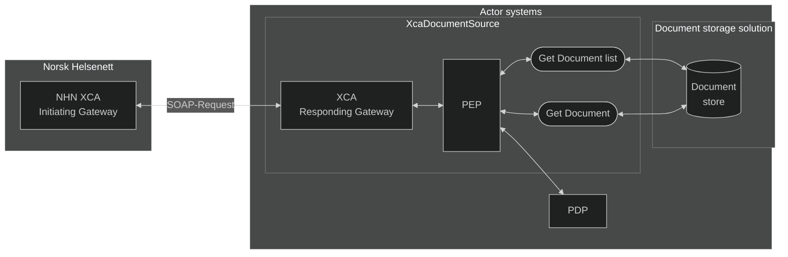
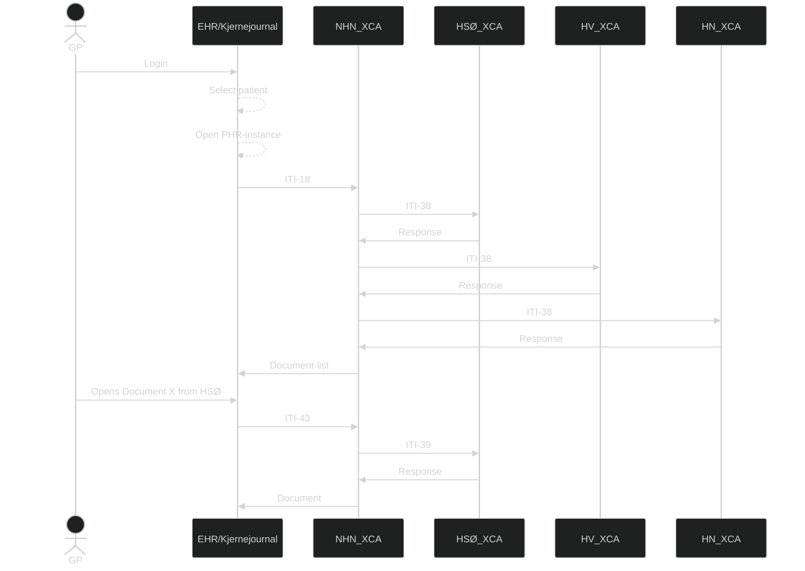

# PJD.XcaDocumentSource - XCA Responding Gateway and integrated Document Registry and Repository  

## Introduction/Getting started
In the healthcare industry, hospitals, clinics, and municipalities use a variety of Electronic Health Record (EHR) systems, often from different vendors. These systems were rarely designed to communicate with each other, leading to:
* Data silos where patient records are confined in local systems
* Manual, error-prone processes for sharing health information
* Delayed treatment due to lack of access to complete medical histories  

This lack of interoperability results in documents having to be shared via manual routines, such as fax-machines, sending as letters via taxi or calling the hospitals a patient has previously visited. This results in fragmented care, increased administrative burden, and risk to patient safety.

**XcaDocumentSource** is a component which acts as a middleware-system between healthcare provider system and Norsk helsenett's XCA-gateway infrastructure. This will allow actors such as hospitals and municipalities to share patient health records across organizational and technical boundaries by handling the SOAP-implementation, and allowing the implementer to easily modify the solution to for integrating between **XcaDocumentSource** and their own systems.  
The implementation is based around the IHE integration profiles based on **XDS** and **XCA** provided in Volumes 1 through 3 of the [IHE IT Infrastructure Technical Framework - profiles.ihe.net ↗](https://profiles.ihe.net/ITI/TF/index.html) in a national context, aswell as **HL7** and **XACML**:
* XDS.b (Cross-Enterprise Document Sharing) – for registering and retrieving clinical documents
* XCA (Cross-Community Access) Responding Gateway – for querying and retrieving documents from NHN's XCA  
* HL7 (Health Level 7) version 2 - for some queries related to patient identity
* PEP (Policy Enforcement Point) - for access control

### Technical overview

*Solution architecture overview*

## Solution Documentation

### [⚙️ Technical implementation details](/Docs/TechnicalImplementation.md)
How **PJD.XcaDocumentSource** solution is structured, and how it can be implemented in a source system, taking in account existing document registries/repositories, and PAP/PDP/PR systems.

### [🧾 Metadata, XDS and SOAP-message formats and standards](/Docs/XdsAndSoap.md)
Covering the SOAP-message format and the XDS profile and transactions involved in uploading, downloading and sharing documents and document metadata.

### [📨 ITI-messages](/Docs/XdsTransactions.md)
Overviews the ITI-messages supported by **XcaDocumentSource** and their endpoints, as well as examples.

### [🏥 HL7 Messaging and Patient identity](/Docs/Hl7MessagingPatientIds.md)
Describes the lightweight implementation of HL7 messaging, allowing for Patient Demographics and Identity lookups and cross-referencing

### [💠 OIDs (Object Identifiers)](/Docs/Oids.md)
OIDs are important in identifying the different components in the systems involved in the document sharing exchange. Effective governing and managing of OIDs are crucial in efficiently identifying systems.

## Other Functionality

### [🖥️ XDS Admin Front-End](/Docs/XdsAdminFrontEnd.md)
Documentation of the Admin-GUI which also serves as a practical tool for interacting with the document registry and repository

### [📄 CDA To Registry Metadata](/Docs/CdaRegistryMetadata.md)
Describes the functionality of the CDA to ITI-41/Registry Metadata solution included in XcaDocumentSource.

## Document sharing - Actors and components  
The **XDS-architecture** consists of the following actors/components:

### Document source  
A document source is typically an **EHR-system** or backend solution which has produced or stores a document which will be shared using the **XDS-solution**.

### Document consumer  
A document consumer is typically a **EHR-system** (or citizen portal) which queries the **Document Source** for documents on a given patient.

### Document repository
A document repository is the service responsible for storing or making the document accessible. an **XDS-solution** can consist of one or more document repositories.

### Document Registry  
The Document Registry contains information (metadata) about all archived documents in the XDS area served by this document repository. An XDS site is always served by only one document repository, but a document repository can cover multiple XDS areas.
In addition to metadata about existing documents, the document register contains pointers to the document archive where the document is stored.

### Affinity Domain  
The concept of an Affinity Domain is, literally and figuratively, central in the realm of sharing health documents. The XDS-profile describes how documents are shared across enterprise boundaries within an Affinity Domain, as well as the rules that make sharing possible. An Affinity Domain has its own unique identifier, known as a **HomeCommunityID**. This ID is used when querying the domain.  
The boundaries of an Affinity Domain is not specified, but a logical separation within a country is natural. In Norway, this separation is on a **RHF** (Regionalt helseforetak)-level. This level of separation makes it possible for the Affinity Domains to profilings catered towards the needs of both the domain, aswell as the **RHF**.

### Patient identity source  
This component ensures every patient is given an **unambigous identificator**, for example a local, regional or nationwide population register.
>**🚩 National Extension**  In Norway, a personal identificator is in use (person number), so a dedicated service for handling patient identifications is not required.

## Document consuming process
Below is a diagram showing the process of retrieving the document-list and the document. Each affinity domain has its own XCA, which again has its own registry and repositories.  
When querying for a list of documentr , the Registry is queried, as it holds the metadata and references to the documents in the repository. When retrieving a document, the repository is queried with the ID from the Registry metadata item of interest.

*Figure x: Simplified example on a query of document, each XCA is its own affinity domain, and the response for each domain may be different (ie. some domains reject requests from certain GP-roles)*

## Semantics Used  
This section defines how different elements are formatted and referenced within the documentation.

### External hyperlinks
External links are suffixed by an arrow pointing up to the right (↗), signifying that the link leads to a website not affiliated or related to Norsk helsenett. Links will follow this format:  `<title> - <domain> ↗`
**Example:**  
[External link - example.com ↗](https://www.example.com) 

### XML-tags  
Used when referencing something thats part of an XML SOAP-message  
**Example:**   
`<xml-tag>`

### Normal Quotes  
Used as an addendum for a section of text  
**Example:**  
>Quote

### Alert Quote
When there's something that should be paid extra attention to, or is important to know  
**Example:**
> **⚠️ Alert x**   Example text

### Implementation Quotes  
Used to describe an implementation which is notable or specific to **PJD.XcaDocumentSource**  
**Example:**
>**🔶 Implementation Note x**   Example text

### National Extension Quote  
Used to describe something specific to the **Norwegian** implementation of **IHE XDS/XCA**  
**Example:**
>**🚩 National Extension x**   Example text

