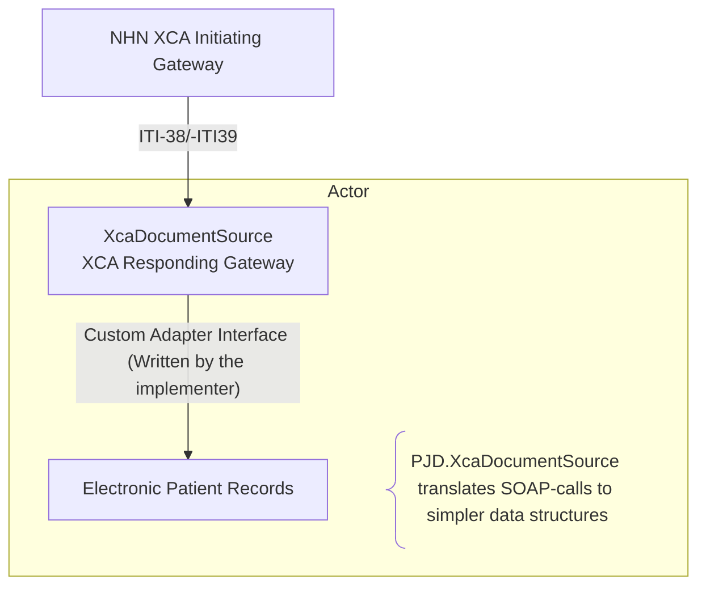
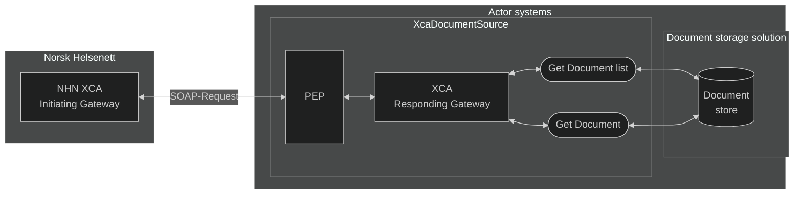

# PJD.XcaDocumentSource – Open Source XCA Responding Gateway Adapter Framework

## Preface: The vision of PJD.XcaDocumentSource
> ⚠ **Important Note!** <br>**PJD.XcaDocumentSource** is provided as an open-source reference for the implementer to extend or customize its interfaces to align with the requirements of their existing Electronic Patient Record (EPR) systems.  
The solution is **not** a substitute for an EPR system nor an EPR storage solution; it acts as a translating framework between SOAP messages from NHN's XCA and the implementers **existing** EPR-system.<br><br></span>
**Norsk helsenett (NHN) does not assume responsibility for the integrity, availability, or confidentiality of patient data handled through deployments based on PJD.XcaDocumentSource. Use of PJD.XcaDocumentSource is at the implementer's own risk, and any integration between PJD.XcaDocumentSource and live Electronic Patient Record (EPR) systems must be thoroughly tested and validated within the implementer’s own governance and compliance frameworks.**

**PJD.XcaDocumentSource** allows healthcare providers to expose their internal, **existing document storage solution** as an **XDS-compliant Registry** and **Repository** interface.  
The solution serves as a protocol adapter layer that abstracts **SOAP**, **ebXML**, and **ebRIM** formatted messages behind a simplified **RESTful API layer**. This significantly reduces integration friction with an actor's existing storage solution, by translating complex ITI messages into implementation-defined, simplified internal representations suitable for integration with custom document APIs.

* Implements IHE XCA profile for cross-community access
* Provides an XDS.b-compatible registry and repository layer backed by customizable storage adapters
* Supports integration with Norsk Helsenett’s XCA Initiating Gateway

**PJD.XcaDocumentSource** does not provide document storage itself. Instead, it allows implementers to connect their own storage infrastructure - whether proprietary, legacy, or standards-based—by implementing custom translation logic between document storage metadata and the simpler, internal data-structures.


```
 [External XCA Initiating Gateway]
             ↓ ITI-38/39
  [XcaDocumentSource Translation Layer, simple data structures]
             ↓ Custom Adapter Interface (Written by the implementer)
     [Existing Document Storage Backend]
```

It aims to accelerate prototyping and integration with NHN, without requiring full knowledge of **IHE profiles** and **ebXML RegRep** specifications up-front; the solution handles the complexities of SOAP and XML, essentially "doing the plumbing work". This allows the end user to focus on their domain-specific implementations needs, like shaping business logic and handling access control.

Architecturally, **PJD.XcaDocumentSource** acts as a translation gateway that sits between an external XCA Initiating Gateway (e.g., NHN) and an organization’s internal EPR system, mapping IHE protocols to local API formats.


## Introduction/Getting started
In the healthcare industry, hospitals, clinics, and municipalities use a variety of Electronic Health Record (EHR) systems, often from different vendors. These systems were rarely designed to communicate with each other, leading to:
* Data silos where patient records are confined in local systems
* Manual, error-prone processes for sharing health information
* Delayed treatment due to lack of access to complete medical histories  

This lack of interoperability results in documents having to be shared via manual routines, such as fax-machines, sent as letters via taxi or calling the hospitals a patient has previously visited. This results in fragmented care, increased administrative burden, and risk to patient safety.

**PJD.XcaDocumentSource** is a component which acts as a middleware-system between healthcare provider system and Norsk helsenett's XCA-gateway infrastructure. This will allow actors such as hospitals and municipalities to share patient health records across organizational and technical boundaries by handling the SOAP-implementation, and allowing the implementer to easily modify the solution to for integrating between **PJD.XcaDocumentSource** and their own systems.  
The implementation is based around the IHE integration profiles based on **XDS** and **XCA** provided in Volumes 1 through 3 of the [IHE IT Infrastructure Technical Framework - profiles.ihe.net ↗](https://profiles.ihe.net/ITI/TF/index.html) in a national context, aswell as **HL7** and **XACML**:

* XDS.b (Cross-Enterprise Document Sharing) – for registering and retrieving clinical documents
* XCA (Cross-Community Access) Responding Gateway – for querying and retrieving documents from NHN's XCA  
* HL7 (Health Level 7) version 2 - for some queries related to patient identity
* PEP (Policy Enforcement Point) - for access control (XACML-implementation)

### Technical overview

*Solution architecture overview*


## Solution Documentation

### [🌐 Document Sharing overiew - Actors and Components](/Docs/Overview.md)
Describes the high-level principles of document sharing, and the components involved in the process.

### [📝 Use case scenarios - PJD.XcaDocumentSource](/Docs/UseCases.md)
Scenarios of PJD.XcaDocumentSource in a source system.

### [⚙️ Solution Overview/Technical implementation details](/Docs/TechnicalImplementation.md)
How **PJD.XcaDocumentSource** solution is structured, and how it can be implemented in a source system, taking in account existing document registries/repositories, and PAP/PDP/PR systems.

### [📜 Custom Registry Format](/Docs/RegistryDto.md)
Describes the custom Registry format which is used to store document entries.

### [🧾 (ebRIM) Metadata, XDS and SOAP-message formats and standards](/Docs/XdsAndSoap.md)
Covering the SOAP-message format and the XDS profile and transactions involved in uploading, downloading and sharing documents and document metadata.

## Interacting With the Document Registry/Repository

### [📨 SOAP-endpoints/ITI-messages (SOAP-transactions)](/Docs/XdsTransactions.md)
Overviews the ITI-messages supported by **XcaDocumentSource** and their endpoints, as well as examples.

### [👩‍💻 REST-endpoints (CRUD-transactions)](/Docs/RestTransactions.md)
Describes the REST-endpoints of the solution, allowing for quick and easy CRUD-operations on the Document Registry and Repository.

## Governing the solution

### [💠 OIDs (Object Identifiers)](/Docs/Oids.md)
OIDs are important in identifying the different components in the systems involved in the document sharing exchange. Effective governing and managing of OIDs are crucial in efficiently identifying systems.

## Other Functionality

### [🖥️ XDS Admin Front-End](/Docs/XdsAdminFrontEnd.md)
Documentation of the Admin-GUI which also serves as a practical tool for interacting with the document registry and repository

### [📄 CDA To Registry Metadata](/Docs/CdaRegistryMetadata.md)
Describes the functionality for converting a CDA document to an ITI-41 message/Registry Metadata and vice-versa.

### [🏥 HL7 Messaging and Patient identity](/Docs/Hl7MessagingPatientIds.md)
Describes the lightweight but expandable implementation of HL7 messaging, allowing for Patient Demographics and Identity lookups and cross-referencing


## Coding Conventions

The following coding conventions are used in XcaDocumentSource. They are not enforced onto the implementer, but described here for informational purposes:
- Functions are used extensively to break up code and separate concerns. Functions should rarely be more than 100 lines.
  - Functions should have a single purpose (SRP)
- Service-classes encapsulate functionality related to a single "purpose" or function (interact with registry/repository, transform objects from X to Y format etc.)
- Naming:
  - `PascalCase` for classes, methods, and public properties.
  - `camelCase` for local variables and private fields.
- File structure: One class per file.
- Indentation: 4 spaces (no tabs).
- Uses `async/await` over `Task.ContinueWith`, no `.Result` or `.Wait()`.
- Avoid abbreviations in names (e.g., `userProfile`, not `usrProf`, can be abbreviated for long variable names).

### Separation of concerns
The code is divided into clear layers (API/controller, Service, Wrapper, Domain(classes))
```
/Controllers
  - RegistryController.cs
/Services
  - RegistryService.cs
/Repositories
  - RegistryWrapper.cs
```

## Semantics Used  
This section defines how different elements are formatted and referenced within the documentation.

### External hyperlinks
External links are suffixed by an arrow pointing up to the right (↗), signifying that the link leads to a website not affiliated or related to Norsk helsenett. Links will follow this format:  `<title> - <domain> ↗`
**Example:**  
[External link - example.com ↗](https://www.example.com) 

### XML-tags  
Used when referencing something thats part of an XML SOAP-message  
**Example:**   
`<xml-tag>`


### Normal Quotes  
Used as an addendum for a section of text  
**Example:**  
>Quote

### Alert Quote
When there's something that should be paid extra attention to, or is important to know  
**Example:**
> **⚠️ Alert x** <br> Example text

### Implementation Quotes  
Used to describe an implementation which is notable or specific to **PJD.XcaDocumentSource**  
**Example:**
>**🔶 Implementation Note x** <br> Example text

### National Extension Quote  
Used to describe something specific to the **Norwegian** implementation of **IHE XDS/XCA**  
**Example:**
>**🚩 National Extension x** <br> Example text