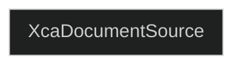

# PJD.XcaDocumentSource - XCA Responding Gateway and integrated Document Registry and Repository  

## Introduction/Getting started
In many healthcare systems, hospitals, clinics, and municipalities use a variety of Electronic Health Record (EHR) systems, often from different vendors. These systems were rarely designed to communicate with each other, leading to:
* Data silos where patient records are locked in local systems
* Manual, error-prone processes for sharing health information
* Delayed treatment due to lack of access to complete medical histories  

This lack of interoperability results in fragmented care, increased administrative burden, and risk to patient safety.

**PJD.XcaDocumentSource** is a component which acts as a middleware-system between healthcare provider system and Norsk helsenett's XCA-gateway infrastructure. This will allow actors such as  IHE integration profiles based on XDS, XCA and XUA provided in Volumes 1 through 3 of the [IHE IT Infrastructure Technical Framework ↗](https://profiles.ihe.net/ITI/TF/index.html) in a national context.

The XcaDocumentSource solution is designed to address this interoperability gap by enabling hospitals and municipalities to share patient health records across organizational and technical boundaries.

It does this by implementing key standards defined by the Integrating the Healthcare Enterprise (IHE) initiative, specifically:
* XDS.b (Cross-Enterprise Document Sharing) – for registering and retrieving clinical documents
* XCA (Cross-Community Access) – for querying and retrieving documents across different health information exchanges
* XUA (Cross-Enterprise User Assertion) – for user identity and authorization propagation via SAML

## Solution Documentation

### [⚙️ Technical implementation details](/Docs/TechnicalImplementation.md)
How **PJD.XcaDocumentSource** solution is structured, and how it can be implemented in a source system, taking in account existing document registries/repositories, and PAP/PDP/PR systems.

### [🧾 Metadata, XDS and SOAP-message formats and standards](/Docs/XdsAndSoap.md)
Covering the SOAP-message format and the XDS profile and transactions involved in uploading, downloading and sharing documents and document metadata.

### [🏥 HL7 Messaging and Patient identity](/Docs/Hl7MessagingPatientIds.md)
Describes the lightweight implementation of HL7 messaging, allowing for Patient Demographics and Identity lookups and cross-referencing

### [🖥️ XDS Admin Front-End](/Docs/XdsAdminFrontEnd.md)
Documentation of the Admin-GUI which also serves as a practical tool for interacting with the document registry and repository

## Document sharing - Actors and components  
The **XDS-architecture** consists of the following actors/components:

### Document source  
A document source is typically an **EHR-system** or backend solution which has produced or stores a document which will be shared using the **XDS-solution**.

### Document consumer  
A document consumer is typically a **EHR-system** (or citizen portal) which queries the **Document Source** for documents on a given patient.

### Document repository
A document repository is the service responsible for storing or making the document accessible. an **XDS-solution** can consist of one or more document repositories.

### Document Registry  
The Document Registry contains information (metadata) about all archived documents in the XDS area served by this document repository. An XDS site is always served by only one document repository, but a document repository can cover multiple XDS areas.
In addition to metadata about existing documents, the document register contains pointers to the document archive where the document is stored.

### Affinity Domain  
The concept of an Affinity Domain is, literally and figuratively, central in the realm of sharing health documents. The XDS-profile describes how documents are shared across enterprise boundaries within an Affinity Domain, as well as the rules that make sharing possible. An Affinity Domain has its own unique identifier, known as a **HomeCommunityID**. This ID is used when querying the domain.  
The boundaries of an Affinity Domain is not specified, but a logical separation within a country is natural. In Norway, this separation is on a **RHF** (Regionalt helseforetak)-level. This level of separation makes it possible for the Affinity Domains to profilings catered towards the needs of both the domain, aswell as the **RHF**.

### Patient identity source  
This component ensures every patient is given an **unambigous identificator**, for example a local, regional or nationwide population register.
>**🚩 National Extension**  In Norway, a personal identificator is in use (person number), so a dedicated service for handling patient identifications is not required.

## Object Identifiers (OID)
>**Note:** For OIDs to effectively work, there must be some level of governance when creating and managing OIDs. Norsk helsenett (NHN) should have a comprehensive overview of the OIDs related to PHR. NHN shall be informed of the OID of a new document source.

OID (Object Identifiers) are unique identifiers for objects or things. **Anything can have an OID, and an OID is nothing more than a set of numbers and dots (.) which make up a hierarchical structure**. In PHR, OIDs are used to unambiguously identify a system or facility. The OIDs might get translated by the systems into the actual URL, which means the URL can change, but the OID stays the same. OIDs are also used in logging. OIDs have a "tree/path"-like structure, and can be represented by its numerical or text variant.  
More about OIDs on [NHN's Developer portal ↗](https://utviklerportal.nhn.no/informasjonstjenester/pasientens-journaldokumenter-i-kjernejournal/mer-om-tjenesten/oider/) (In Norwegian).  

### Governing Object Identifiers
Even though OIDs are simply numbers and dots, its the way that its governed and controlled which defines its effectiveness in practice. Having good control over an OID structure leads to effective communication and identification.   

>**🔶 Implementation Note x**   In **PJD.XcaDocumentSource**, OIDs are used for **RepositoryID** and **HomecommunityID**.

The **Norwegian profile of IHE XDS metadata** defines the use of OIDs for identifying communities. Norsk helsenett (NHN) governs an OID-base and is the primary issuer of an OID to a community. Each Norwegian health region also governs their own OIDbase and can choose to issue their own homecommunity ID.  
The OID-base which NDE governs has the following OID structure for document sharing:
* 2.16.578.1.12.4.1.7 – Document sharing root OID
  * 2.16.578.1.12.4.1.7.1 – Community base OIDs governed by NHN
    * 2.16.578.1.12.4.1.7.1.1 – National community
> **⚠️ Alert x:**   Historically, this OID-base has belonged to The Norwegian Directorate of eHealth (NDE/e-Helse) for PHR (formely known as Dokumentdeling)

## Document consuming process
Below is a diagram showing the process of retrieving the document-list and the document. Each affinity domain has its own XCA, which again has its own registry and repositories.  
When querying for a list of documentr , the Registry is queried, as it holds the metadata and references to the documents in the repository. When retrieving a document, the repository is queried with the ID from the Registry metadata item of interest.

```mermaid
%%{init: {'theme':'dark'}}%%

sequenceDiagram
    actor GP
    participant KJ as EHR/Kjernejournal
    participant NHN_XCA
    participant HSØ_XCA
    participant HV_XCA
    participant HN_XCA
    GP->>KJ:Login
    KJ-->>KJ:Select patient
    KJ-->>KJ:Open PHR-instance
    KJ->>NHN_XCA:ITI-18
    NHN_XCA->>HSØ_XCA:ITI-38
    HSØ_XCA->>NHN_XCA:Response
    NHN_XCA->>HV_XCA:ITI-38
    HV_XCA->>NHN_XCA:Response
    NHN_XCA->>HN_XCA:ITI-38
    HN_XCA->>NHN_XCA:Response
    NHN_XCA->>KJ:Document-list
    GP->>KJ:Opens Document X from HSØ
    KJ->>NHN_XCA:ITI-43
    NHN_XCA->>HSØ_XCA:ITI-39
    HSØ_XCA->>NHN_XCA:Response
    NHN_XCA->>KJ:Document
```

*Figure x: Simplified example on a query of document, each XCA is its own affinity domain, and the response for each domain may be different (ie. some domains reject requests from certain GP-roles)*

## Semantics Used  
This section defines how different elements are formatted and referenced within the documentation.

### External hyperlinks
External links are suffixed by an arrow pointing up to the right (↗), signifying that the link leads to a website not affiliated or related to Norsk helsenett. Links will follow this format:  `<title> - <domain> ↗`
**Example:**  
[External link - example.com ↗](https://www.example.com) 

### XML-tags  
Used when referencing something thats part of an XML SOAP-message  
**Example:**   
`<xml-tag>`

### Normal Quotes  
Used as an addendum for a section of text  
**Example:**  
>Quote

### Alert Quote
When there's something that should be paid extra attention to, or is important to know  
**Example:**
> **⚠️ Alert x**   Example text

### Implementation Quotes  
Used to describe an implementation which is notable or specific to **PJD.XcaDocumentSource**  
**Example:**
>**🔶 Implementation Note x**   Example text

### National Extension Quote  
Used to describe something specific to the **Norwegian** implementation of **IHE XDS/XCA**  
**Example:**
>**🚩 National Extension x**   Example text

